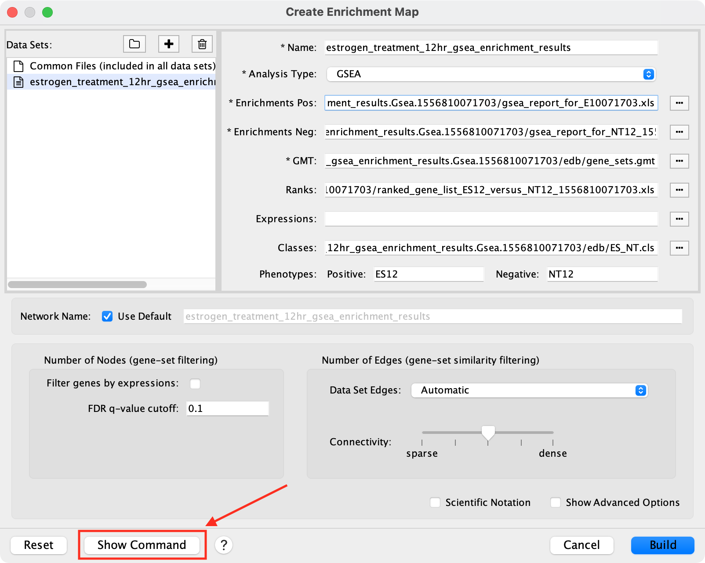

Automating EnrichmentMap
========================

EnrichmentMap provides several commands which allow basic features to be automated
via scripts, the command line or REST.

.. note:: For more details on the Command Line Dialog and Cytoscape command syntax see the 
          `Cytoscape User Docs <http://manual.cytoscape.org/en/stable/Command_Tool.html>`_

.. note:: For more details on using CyRest to call commands via REST see the 
          `CyREST Documentation <https://github.com/cytoscape/cyREST/wiki/Introduction>`_


List of Available Commands
--------------------------

The provided commands are in the ``enrichmentmap`` namespace.

+---------------------------------+--------------------------------------------------------------------------+
| **Command**                     | | **Description**                                                        |
+---------------------------------+--------------------------------------------------------------------------+
| `enrichmentmap build`_          | | Creates an EnrichmentMap network containing one or two                 |
|                                 | | data sets.                                                             |
+---------------------------------+--------------------------------------------------------------------------+
| `enrichmentmap mastermap`_      | | Creates an EnrichmentMap network containing any                        |
|                                 | | number of data sets by scanning files in a folder.                     |
+---------------------------------+--------------------------------------------------------------------------+
| `enrichmentmap mastermap list`_ | | Scans files in a folder and prints out how they would                  |
|                                 | | be grouped into data sets, but does not create a network.              |
|                                 | | This command is intended to help debug the                             |
|                                 | | 'mastermap' command by showing how the files will be                   |
|                                 | | grouped into data sets without actually creating the network.          | 
+---------------------------------+--------------------------------------------------------------------------+
| `enrichmentmap build-table`_    | | Creates an EnrichmentMap network from values in a table.               |
+---------------------------------+--------------------------------------------------------------------------+
| `enrichmentmap pa`_             | | Runs post-analysis. Adds more gene sets to an existing                 |
|                                 | | network. This is done by calculating the overlap between               |
|                                 | | gene sets of the current EnrichmentMap network and all the             |
|                                 | | gene sets contained in the provided signature gene set file.           |
+---------------------------------+--------------------------------------------------------------------------+
| `enrichmentmap chart`_          | | Sets the chart options for an EnrichmentMap network.                   |
+---------------------------------+--------------------------------------------------------------------------+
| `enrichmentmap dataset hide`_   | | Allows to de-select the data sets to show in an                        |
|                                 | | EnrichmentMap network.                                                 |
+---------------------------------+--------------------------------------------------------------------------+
| `enrichmentmap dataset show`_   | | Allows to select the data sets to show in an EnrichmentMap             |
|                                 | | network.                                                               |
+---------------------------------+--------------------------------------------------------------------------+
| `enrichmentmap dataset color`_  | | Allows to change the colors assigned to data sets.                     |
+---------------------------------+--------------------------------------------------------------------------+
| `enrichmentmap export model`_   | | Exports the EnrichmentMap data model to a file. Intended               |
|                                 | | mainly for debugging.                                                  |
+---------------------------------+--------------------------------------------------------------------------+
| `enrichmentmap export pdf`_     | | Exports the contents of the Heat Map panel to a PDF file.              |
+---------------------------------+--------------------------------------------------------------------------+
| `enrichmentmap export png`_     | | Exports the network view to an image file in the users home directory. |
+---------------------------------+--------------------------------------------------------------------------+
| enrichmentmap gseabuild         | | Creates an EnrichmetMap network from one or two GSEA                   |
|                                 | | results.                                                               |
|                                 | | (Deprecated, use 'build' or 'mastermap' command instead.)              |
+---------------------------------+--------------------------------------------------------------------------+


Show Command Button
-------------------

The **Create EnrichmentMap Dialog** provides a **Show Command** button for help using the `enrichmentmap mastermap`_ command.
This button opens a pop-up that shows the command based on the values entered into the dialog.
The command can be used in a script to automate the creation of an EnrichmentMap network.




Commands
--------

enrichmentmap build
~~~~~~~~~~~~~~~~~~~

  Creates an EnrichmentMap network containing one or two data sets. 

  Arguments:

    **analysisType** (GSEA|generic|DAVID/BiNGO/Great)

      Analysis Type

    **classDataset1** <File path>

      Path to Classes File for Dataset 1 specifying the classes of each sample in expression file. Format: see GSEA website

    **classDataset2** <File path>

      Path to Classes File for Dataset 2 specifying the classes of each sample in expression file. format: see GSEA website

    **coefficients** (OVERLAP|JACCARD|COMBINED)

      Used to choose the formula used to calculate the similarity score.

    **coeffecients** (OVERLAP|JACCARD|COMBINED)

      Deprecated, use 'coefficients' instead.

    **combinedConstant** <double>

      When coefficients=COMBINED this parameter is used to determine what percentage to use for JACCARD and OVERLAP when 
      combining their value.Value between 0 and 1, where 0 means 100% JACCARD and 0% OVERLAP, and 1 means 0% JACCARD and 
      100% OVERLAP.

    **edgeStrategy** (AUTOMATIC|DISTINCT|COMPOUND)

      DISTINCT: Create separate edges for each data set when appropriate. A separate similarity score will be calculated 
      for each data set. COMPOUND: Gene sets with the same name are combined (set union) and then the similarity score is 
      calculated. AUTOMATIC: EnrichmentMap decides which of the previous options to use. See the EnrichmentMap documentation 
      for more details.

    **enrichments2Dataset1** <File path>

      Path to a second Enrichments File for Dataset 1 specifying enrichment results.

    **enrichments2Dataset2** <File path>

      Path to a second Enrichments File for Dataset 2 specifying enrichment results.

    **enrichmentsDataset1** <File path>

      Path to Enrichments File for Dataset 1 specifying enrichment results.

    **enrichmentsDataset2** <File path>

      Path to Enrichments File for Dataset 2 specifying enrichment results.

    **expressionDataset1** <File path>

      Path to Expression File for Dataset 1 with gene expression values. Format: gene   description   expression value   ...

    **expressionDataset2** <File path>

      Path to Expression File for Dataset 2 with gene expression values. Format: gene   description   expression value   ...

    **filterByExpressions** true|false

      If true then genes that are contained in the gene set (GMT) files or the enrichment files, but are not 
      contained in the expression files will not be included in the network.

    **gmtFile** <File path>

      Path to GMT File specifying gene sets. Format: geneset name   description   gene ...

    **pvalue** <Double>

      P-value Cutoff (value between 0 and 1). Gene set nodes with a p-value lower than the given value will 
      not be included in the network.

    **qvalue** <Double>

      FDR Q-value Cutoff (value between 0 and 1). Gene set nodes with a q-value lower than the one entered 
      will not be included in the network.

    **ranksDataset1** <File path>

      Path to a Ranks File for Dataset 1 specifying ranked genes. Format: gene   score or statistic

    **ranksDataset2** <File path>

      Path to Ranks File for Dataset 2 specifying ranked genes. Format: gene   score or statistic

    **similaritycutoff** <Double>

      Similarity Cutoff (value between 0 and 1). Edges with a similarity score lower than the one entered 
      will not be included in the network.

    **minExperiments** <Integer>

      A gene set must be included in this many data sets to be included in the network (optional).

    **nesFilter** (ALL|POSITIVE|NEGATIVE)

      POSITIVE: Only gene sets from the positive enrichment file will be included. NEGATIVE: Only gene sets 
      from the negative enrichment file will be included. All: Both enrichment files will be included

    **networkName** <String>

      The name of the EnrichmentMap network. If not provided then EnrichmentMap will automatically generate a 
      name for the network based on the name of the first data set.

    **phenotype1Dataset1** <String>

      Phenotype 1 for Dataset 1

    **phenotype1Dataset2** <String>

      Phenotype 1 for Dataset 2

    **phenotype2Dataset1** <String>

      Phenotype 2 for Dataset 1

    **phenotype2Dataset2** <String>

      Phenotype 2 for Dataset 2


enrichmentmap mastermap
~~~~~~~~~~~~~~~~~~~~~~~

  Creates an EnrichmentMap network containing any number of data sets by scanning files in a folder. 
  Uses the same algorithm as the Create EnrichmentMap Dialog to scan the files in a folder and automatically 
  group them into data sets. Sub-folders will be scanned up to one level deep, allowing you to organize 
  your data sets into sub-folders under the root folder. See :ref:`scanning`.

  Arguments:

    **rootFolder** <file path>

      Absolute path to a folder containing the data files. The files will be scanned and automatically 
      grouped into data sets. Sub-folders will be scanned up to one level deep.

    **pattern** <string>

      A glob-style path filter. Sub-folders inside the root folder that do not match the pattern 
      will be ignored. For more details on syntax see 
      `docs for Java glob syntax <https://docs.oracle.com/javase/8/docs/api/java/nio/file/FileSystem.html#getPathMatcher-java.lang.String->`_

    **pvalue** <double>

      P-value Cutoff (value between 0 and 1). Gene set nodes with a p-value lower than the given 
      value will not be included in the network.

    **qvalue** <double>

      FDR Q-value Cutoff (value between 0 and 1). Gene set nodes with a q-value lower than the one 
      entered will not be included in the network.

    **similaritycutoff** <double>

      Similarity Cutoff (value between 0 and 1). Edges with a similarity score lower than the one entered 
      will not be included in the network.

    **coefficients** (OVERLAP|JACCARD|COMBINED)

      Used to choose the formula used to calculate the similarity score. Default is OVERLAP.

    **combinedConstant** <double>

      When coefficients=COMBINED this parameter is used to determine what percentage to use for JACCARD 
      and OVERLAP when combining their value. Value between 0 and 1, where 0 means 100% JACCARD and 0% 
      OVERLAP, and 1 means 0% JACCARD and 100% OVERLAP.

    **commonExpressionFile** <file path>

      Absolute path to an expression file that will be used for every data set. Overrides other expression files.

    **commonGMTFile** <file path>

      Absolute path to a GMT file that will be used for every data set. Overrides other GMT files.

    **edgeStrategy** (AUTOMATIC|DISTINCT|COMPOUND)

      DISTINCT: Create separate edges for each data set when appropriate. A separate similarity score 
      will be calculated for each data set. COMPOUND: Gene sets with the same name are combined (set union) 
      and then the similarity score is calculated. AUTOMATIC: EnrichmentMap decides which of the previous 
      options to use. Default is AUTOMATIC.

    **filterByExpressions** true|false

      If true then genes that are contained in the gene set (GMT) files or the enrichment files, but are 
      not contained in the expression files will not be included in the network.

    **minExperiments** <integer>

      A gene set must be included in this many data sets to be included in the network (optional).

    **nesFilter** (ALL|POSITIVE|NEGATIVE)

      POSITIVE: Only gene sets from the positive enrichment file will be included. 
      NEGATIVE: Only gene sets from the negative enrichment file will be included. 
      All: Both enrichment files will be included. Default is ALL.

    **networkName** <string>

      The name of the EnrichmentMap network. If not provided then EnrichmentMap will automatically 
      generate a name for the network based on the name of the first data set.


enrichmentmap mastermap list
~~~~~~~~~~~~~~~~~~~~~~~~~~~~

  Scans files in a folder and prints out how they would be grouped into data sets, but does not create a network.
  This command is intended to help debug the 'mastermap' command by showing how the files will be
  grouped into data sets without actually creating the network.       
  See :ref:`scanning`.

  Arguments:

    **rootFolder** <file path>

      Absolute path to a folder containing the data files. The files will be scanned and automatically 
      grouped into data sets. Sub-folders will be scanned up to one level deep.

    **pattern** <string>

      A glob-style path filter. Sub-folders inside the root folder that do not match the pattern 
      will be ignored. For more details on syntax see 
      `docs for Java glob syntax <https://docs.oracle.com/javase/8/docs/api/java/nio/file/FileSystem.html#getPathMatcher-java.lang.String->`_


enrichmentmap build-table
~~~~~~~~~~~~~~~~~~~~~~~~~

  Creates an EnrichmentMap network from values in a table. Intended mainly for other Apps to programatically 
  create an EnrichmentMap network.

  Arguments:

    **table** <String>

      Name of the table to import from.
      If the prefix ```SUID:``` is used, the table corresponding the SUID will be returned. 
      Example: "galFiltered.sif default node"

    **genesColumn** <String>

      Name of column that contains the list of genes.

    **nameColumn** <String>

      Name of column that contains the names of the gene sets.

    **pvalueColumn** <String>

      Name of column that contains p values.

    **descriptionColumn** <String>

      Name of column that contains the gene set description (optional).

    **coefficients** (OVERLAP|JACCARD|COMBINED)

      Used to choose the formula used to calculate the similarity score.

    **combinedConstant** <double>

      When coefficients=COMBINED this parameter is used to determine what percentage to use for 
      JACCARD and OVERLAP when combining their value.Value between 0 and 1, where 0 means 100% JACCARD 
      and 0% OVERLAP, and 1 means 0% JACCARD and 100% OVERLAP.

    **edgeStrategy** (AUTOMATIC|DISTINCT|COMPOUND)

      DISTINCT: Create separate edges for each data set when appropriate. A separate similarity score 
      will be calculated for each data set. COMPOUND: Gene sets with the same name are combined (set union) 
      and then the similarity score is calculated. AUTOMATIC: EnrichmentMap decides which of the previous 
      options to use. See the EnrichmentMap documentation for more details.

    **filterByExpressions** true|false

      If true then genes that are contained in the gene set (GMT) files or the enrichment files, 
      but are not contained in the expression files will not be included in the network.

    **minExperiments** <Integer>

      A gene set must be included in this many data sets to be included in the network (optional).

    **nesFilter** (ALL|POSITIVE|NEGATIVE)

      POSITIVE: Only gene sets from the positive enrichment file will be included. NEGATIVE: Only 
      gene sets from the negative enrichment file will be included. All: Both enrichment files will be included

    **pvalue** <Double>

      P-value Cutoff (value between 0 and 1). Gene set nodes with a p-value lower than the given 
      value will not be included in the network.

    **qvalue** <Double>

      FDR Q-value Cutoff (value between 0 and 1). Gene set nodes with a q-value lower than the one 
      entered will not be included in the network.

    **similaritycutoff** <Double>

      Similarity Cutoff (value between 0 and 1). Edges with a similarity score lower than the one 
      entered will not be included in the network.

    **networkName** <String>

      The name of the EnrichmentMap network. If not provided then EnrichmentMap will automatically 
      generate a name for the network based on the name of the first data set.


enrichmentmap pa
~~~~~~~~~~~~~~~~

  Runs post-analysis. Adds more gene sets to an existing network. This is done by calculating the overlap between
  gene sets of the current EnrichmentMap network and all the gene sets contained in the provided signature gene set file.

  Arguments:

    **network**   current|[column:value|network name]:

      The EnrichmentMap network.

    **dataSetName** <String>

      Name of existing data set to run PA against, or "ALL" to run in batch mode against all data sets.

    **cutoff** <double>

      Edges with a similarity score lower than the one entered will not be included in the network.

    **filterType** (NO_FILTER|HYPERGEOM|MANN_WHIT_TWO_SIDED|MANN_WHIT_GREATER| MANN_WHIT_LESS|NUMBER|PERCENT|SPECIFIC)

      Type of statistical test to use for edge weight. Please see the EnrichmentMap documentation for more details.

    **gmtFile** <File path>

      Absolute path to GMT file containing gene sets to add to the network.

    **hypergeomUniverseType** (GMT|EXPRESSION_SET|INTERSECTION|USER_DEFINED)

      When 'filterType' is HYPERGEOM allows to choose how the value for N is calculated.

    **userDefinedUniverseSize** <int>

      When 'hypergeomUniverseType' is USER_DEFINED, sets the value for N.

    **mannWhitRanks** <MannWhitRanks>

      When using Mann-Whitney allows to specify which rank file to use with each dataset. 
      Example usage "DataSetName1:RankFile1,DataSetName2:RankFile2"

    **name** <String>

      Name of the signature data set that will be created.

    
enrichmentmap chart
~~~~~~~~~~~~~~~~~~~

  Sets the chart options for an EnrichmentMap network. This command is basically the same as setting 
  the chart options in the main EnrichmentMap panel.

  Arguments:

    **colors** (RD_BU_9|RD_BU_3|BR_BG_3|PI_YG_3|PU_OR_3|RD_YL_BU_3)

      Sets the chart colors.

    **data** (NES_VALUE|P_VALUE|FDR_VALUE|PHENOTYPES|DATA_SET|EXPRESSION_DATA|NONE)

      Sets the chart data to show.

    **network** current|[column:value|network name]

    **showChartLabels** true|false

    **type** (RADIAL_HEAT_MAP|HEAT_STRIPS|HEAT_MAP)

      Sets the chart type.


enrichmentmap dataset hide
~~~~~~~~~~~~~~~~~~~~~~~~~~

  Allows to de-select the data sets to show in an EnrichmentMap network. This command is basically 
  the same as clicking the checkboxes next to the data sets in the main EnrichmentMap panel.

  Arguments:

    **datasets** <String>

      Comma separated list of dataset names or indexes, for example 'dataset1,dataset2,3'. The list may 
      also contain positive integers that indicate the index of the dataset in the enrichment map. 
      Alternately use 'ALL' to indicate all data sets.

    **network** current|[column:value|network name]


enrichmentmap dataset show
~~~~~~~~~~~~~~~~~~~~~~~~~~

  Allows to select the data sets to show in an EnrichmentMap network. 
  This command is basically the same as clicking the checkboxes next to the data sets in the main EnrichmentMap panel.

  Arguments:

    **datasets** <String>

      Comma separated list of dataset names or indexes, for example 'dataset1,dataset2,3'. The list may 
      also contain positive integers that indicate the index of the dataset in the enrichment map. 
      Alternately use 'ALL' to indicate all data sets.

    **network** current|[column:value|network name]


enrichmentmap dataset color
~~~~~~~~~~~~~~~~~~~~~~~~~~~

  Allows to change the colors assigned to data sets

  Arguments:

    **datasets** <String>

      Comma separated list of key=value pairs where the key is the name or index of a data set, 
      and the value is an HTML hex color code. 

      Example: "DataSet1=#224433,DataSet2=#887766"

    **network** current|[column:value|network name]


enrichmentmap export model 
~~~~~~~~~~~~~~~~~~~~~~~~~~

  Exports the EnrichmentMap data model to a file. Intended mainly for debugging.

  Arguments:

    **file** <File>

      File used as destination for model JSON. Will be overwritten if it already exists.

    **network** current|[column:value|network name]


enrichmentmap export pdf
~~~~~~~~~~~~~~~~~~~~~~~~

  Exports the contents of the Heat Map panel to a PDF file.    

  Arguments:

    **file** <File>

      Absolute path to the PDF file to be exported. Will be overwritten if it already exists.

    **compress** (NONE|CLASS_MEDIAN|CLASS_MIN|CLASS_MAX| DATASET_MEDIAN|DATASET_MIN|DATASET_MAX)

    **network** current|[column:value|network name]

    **openViewer** true|false

      If true attempts to open a system PDF viewer on the exported file, does not work in headless mode.

    **operator** (union|intersection)

    **selectedOnly** true|false

      true (default) for only selected nodes and edges, false for all nodes and edges

    **showValues** true|false

    **transform** (AS_IS|ROW_NORMALIZE|LOG_TRANSFORM)


enrichmentmap export png
~~~~~~~~~~~~~~~~~~~~~~~~

  Exports the network view to an image file in the users home directory.


Additional Command Documentation
--------------------------------

CyREST App
~~~~~~~~~~

The CyREST App is required to call commands via REST. CyREST is installed by default, but it is updated
often. If you have any issues you may want to make sure the latest version is installed:

1. App Manager

   Open the **App Manager** dialog from the main menu at **Apps > App Manager**.
   Then go to the **Check For Updates** tab. If there is a newer version available it will be listed.

2. App Store

   CyRest can also be installed or updated from the 
   `App Store Website <http://apps.cytoscape.org/apps/cyrest>`_


Swagger Documentation
~~~~~~~~~~~~~~~~~~~~~

On-line documentation for EnrichmentMap commands can be accessed from
the main menu at **Help > Automation > CyREST Command API**. This will open a web
browser with documentation for all the commands that are available through CyREST.
Navigate to the **enrichmentmap** entry and expand it for detailed documentation
on each command.

.. image:: images/automation/swagger2.png

.. note:: For more details on using CyRest see the 
          `CyREST Documentation <https://github.com/cytoscape/cyREST/wiki/Introduction>`_


Command Line Dialog Documentation
~~~~~~~~~~~~~~~~~~~~~~~~~~~~~~~~~

Open the Command Dialog from the main menu at **Tools > Command Line Dialog**.

Type ``help enrichmentmap`` to list the available commands provided by EnrichmentMap.
To get help on a particular command type, for example the ``build`` command, 
type ``help enrichmentmap build``.

.. image:: images/automation/command_dialog.png
   :width: 500px

.. note:: For more details on the Command Line Dialog see the 
          `Cytoscape User Docs <http://manual.cytoscape.org/en/stable/Command_Tool.html>`_


