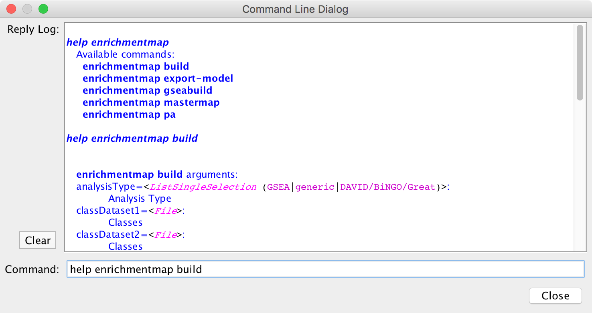

Automating EnrichmentMap
========================

EnrichmentMap provides several commands which allow basic features to be automated
via scripts, the command line or REST.

CyREST App
----------

To call commads via REST the CyREST App is required. CyREST is normally installed by default.

CyRest is updated often. There are two ways to install the latest version:

1. App Manager

   Open the **App Manager** dialog from the main menu at **Apps > App Manager**.
   Then go to the **Check For Updates** tab. If there is a newer version available it will be listed.

2. App Store

   CyRest can also be installed or updated from the 
   `App Store Website <http://apps.cytoscape.org/apps/cyrest>`_

Command Documentation
---------------------

CyREST Documentation
~~~~~~~~~~~~~~~~~~~~

Online documentation for EnrichmentMap commands can be accessed from
the main menu at **Help > Automation > CyREST Command API**. This will open a web
browser with documentation for all the commands that are available through CyREST.
Navigate to the **enrichmentmap** entry and expand it for detailed documentation
on each command.

.. image:: images/automation/swagger2.png

.. note:: For more details on using CyRest see the 
          `CyREST Documentation <https://github.com/cytoscape/cyREST/wiki/Introduction>`_

Command Line Dialog Documentation
~~~~~~~~~~~~~~~~~~~~~~~~~~~~~~~~~

Open the Command Dialog from the main menu at **Tools > Command Line Dialog**.

Type ``help enrichmentmap`` to list the available commands provided by EnrichmentMap.
To get help on a particular command type, for example the ``build`` command, 
type ``help enrichmentmap build``.

.. note:: For more details on the Command Line Dialog see the 
          `Cytoscape User Docs <http://manual.cytoscape.org/en/stable/Command_Tool.html>`_

