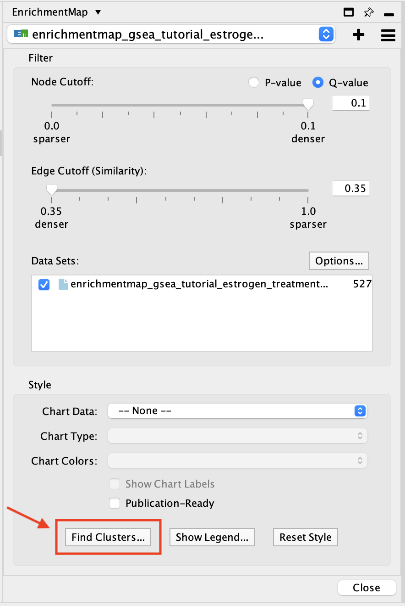
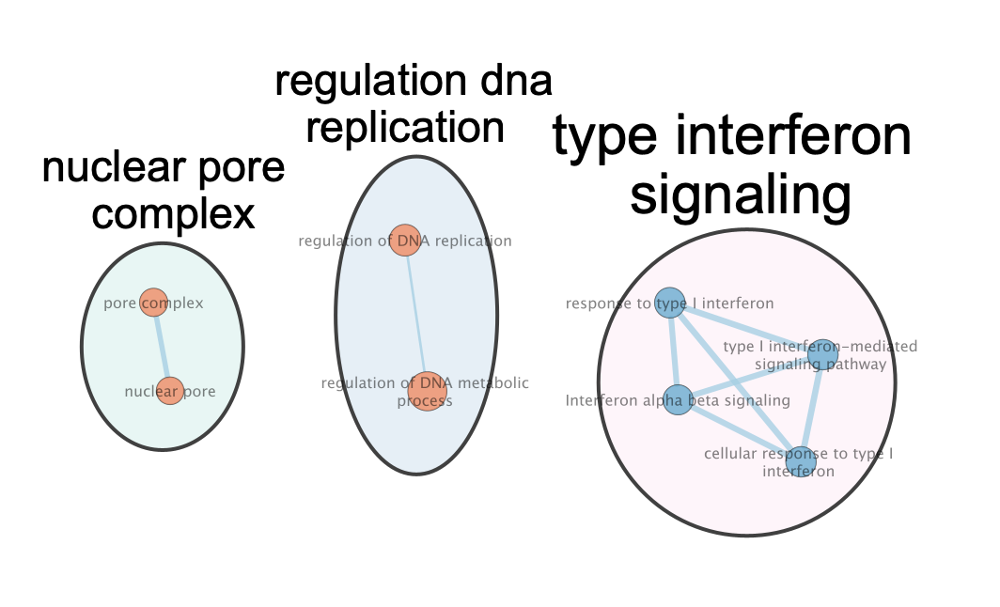
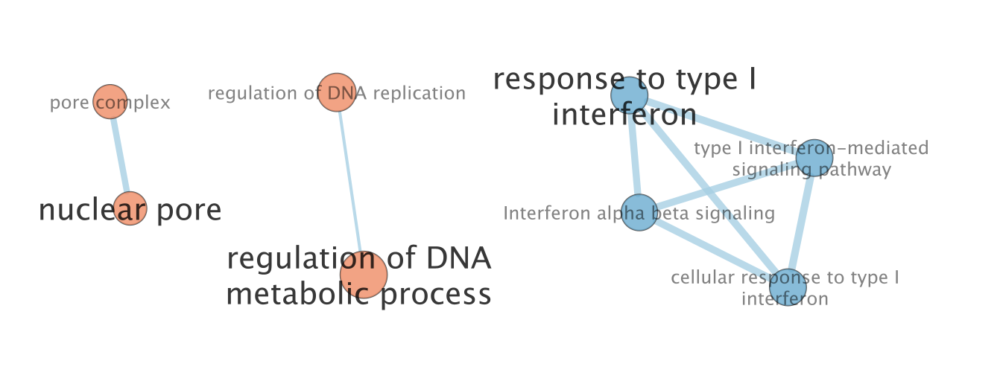
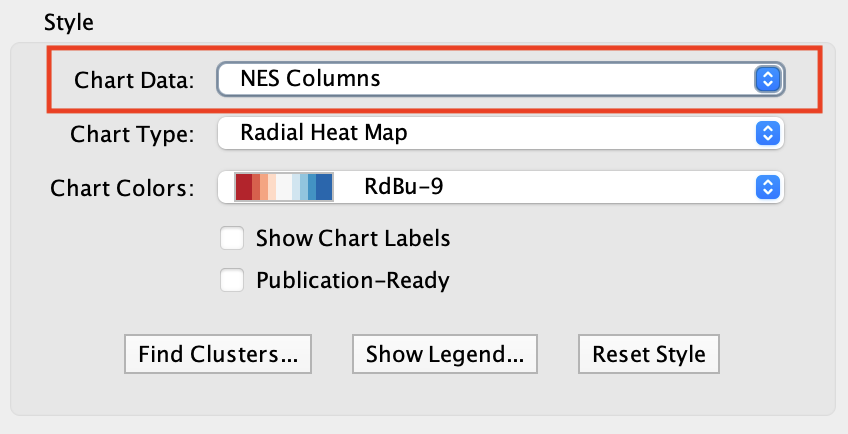
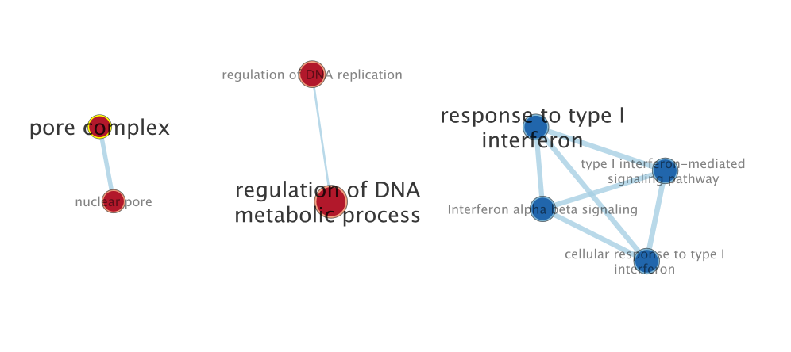

.. _clusters:

Finding Clusters with AutoAnnotate
==================================

The **AutoAnnotate** app must be installed for this functionality.
https://apps.cytoscape.org/apps/autoannotate

At the bottom of the main EnrichmentMap panel there is a button that says
**Find Clusters**.

This button provides two options:

* **Use AutoAnnotate to find clusters of similar nodes**

  * This option simply opens the AutoAnnotate dialog. For more information
    on all the options for finding and highlighting clusters see the AutoAnnotate docs: 
    https://autoannotate.readthedocs.io/en/latest/CreatingAnAnnotationSet.html

* **Highlight significant nodes**

  * This option runs AutoAnnotate automatically. It finds clusters of highly
    significant nodes and simply highlights the most significant node in each cluster.
    Highlighted nodes are given larger labels.

  * The clusters can be seen in the AutoAnnotate main panel.
    https://autoannotate.readthedocs.io/en/latest/WorkingWithAutoAnnotate.html

Significance
~~~~~~~~~~~~

The attribute used to determine significance is based on the current **Chart Data** setting
in the Style panel. If you change the Chart Data attribute it will update the highlighted
nodes accordingly.

