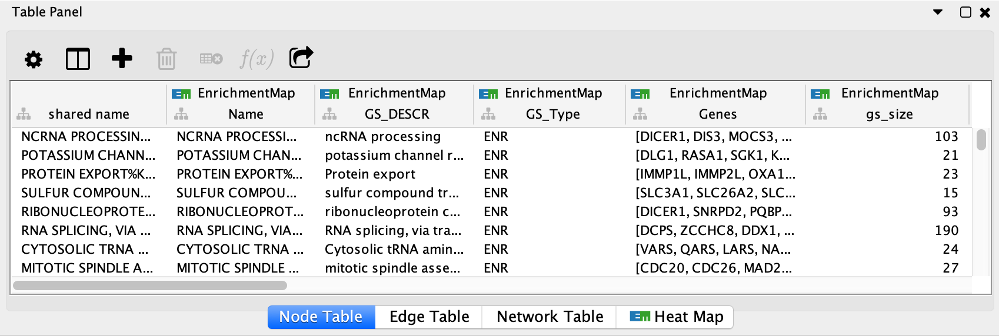

.. _columns:

Columns
=======

EnrichmentMap creates several columns in the node and edge tables. They can
be seen in the **Node Table** and **Edge Table** panels. 

Columns created by EnrichmentMap have the following pattern: ::

  EnrichmentMap::column_name (data_set_name)

* ``EnrichmentMap::`` is the **namespace prefix**. This tells Cytoscape that
  the column is in the **EnrichmentMap** namespace. 
* ``data_set_name`` is used to differentiate between data sets. 
  There will be one such column for each data set.

.. note:: Older versions of EnrichmentMap used the format ``EM1_column_name`` for column names.

Node Columns
~~~~~~~~~~~~

  EnrichmentMap::Name
    The gene set name.

  EnrichmentMap::Formatted_name
    A wrapped version of the gene set name so it is easy to visualize.

  EnrichmentMap::GS_DESCR
    The gene set description (as specified in the second column of the gmt file).

  EnrichmentMap::Genes
    The list of genes that are part of this gene set. 

  EnrichmentMap::gs_size
    Number of genes the union of the gene set across all data sets.

  EnrichmentMap::GS_Type
    Used by the visual style to discern between regular enrichment nodes and 
    signature gene set nodes.

  EnrichmentMap::-log10(pvalue)_max
    Maximum value of all the -log10(pvalue) (dataset name) columns.

Additionally there are attributes created for each dataset:

  EnrichmentMap::pvalue (...)
    Gene set p-value, as specified in GSEA enrichment result file.

  EnrichmentMap::-log10(pvalue) (...)
    Log of the pvalue.

  EnrichmentMap::fdr_qvalue (...)
    Gene set q-value, as specified in GSEA enrichment result file.

GSEA specific attributes (these attributes are not populated when creating an enrichment 
map using the generic mode).

  EnrichmentMap::ES_dataset (...)
    Enrichment score, as specified in GSEA enrichment result file.

  EnrichmentMap::NES_dataset (...)
    Normalized Enrichment score, as specified in GSEA enrichment result file.

  EnrichmentMap::fwer_qvalue (...)
    Family-wise error score, as specified in GSEA enrichment result file. 

  EnrichmentMap::-log10(pvalue)*sign(NES) (...)
    Log of the pvalue multiplied by the sign (ie 1 or -1) of the NES value.
    When used for a node color style mapping this allows different colors for up vs down regulated gene sets.

Edge Columns
~~~~~~~~~~~~

For each Enrichment map created the following attributes are created for each edge:

  EnrichmentMap::Data Set
    Contains the name of the data set that the edge is associated with, or 'compound'
    if the *Combine edges across data sets* option was selected when the network was created.

  EnrichmentMap::Overlap_size
    The number of genes associated with the overlap of the two gene sets that this edge connects.

  EnrichmentMap::Overlap_genes
    The names of the genes that are associated with the overlap of the two gene sets that this 
    edge connects.

  EnrichmentMap::similarity_coefficient
    The calculated coefficient for this edge. 