.. _creating_network:

Creating a Network
==================

To start using EnrichmentMap go to the Cytoscape main menu and select **Apps > EnrichmentMap**.
This will show the EnrichmentMap panels and open the **Create EnrichmentMap Dialog**.

.. image:: images/quicktour/menu.png
   :width: 50%

The dialog can also be opened by clicking the |plus_button_panel| button at the top
of the main EnrichmentMap panel.

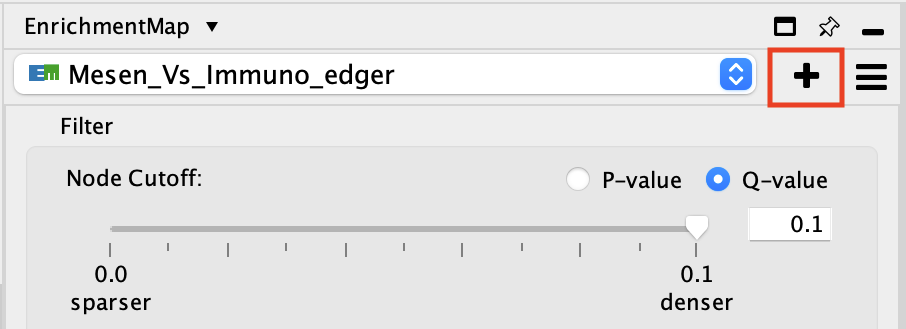

.. note:: See :ref:`file_formats` for details on the various file formats 
          accepted by EnrichmentMap.

Create EnrichmentMap Dialog
---------------------------

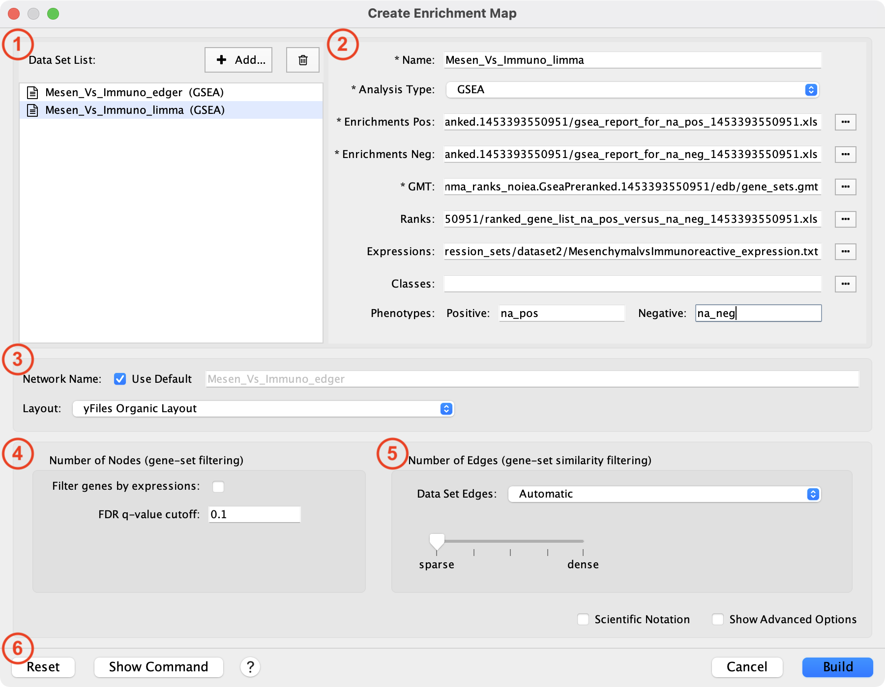

This dialog is used to enter paths to data files and filtering parameters.

The dialog has the following panels: 

1. List of Data Sets.
2. File entry panel.
3. Network name.
4. Node filtering parameters.
5. Edge filtering parameters.
6. Action buttons.

Each of these panels will be explained in more detail below.

If the dialog is closed and then reopened everything that was previously entered will be saved.
You may experiment with creating multiple EnrichmentMap networks with different parameter
choices without having to enter all of the information every time. To clear out and reset all fields
to their defaults click the **Reset** button at the bottom left of the dialog.

1) The Data Set List
--------------------

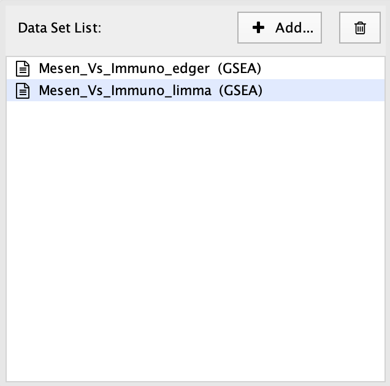

A **Data Set** contains the results of one enrichment analysis, along with associated
data such as expressions, gene sets and classes.

Selecting an entry in the Data Set List will show the 
file input fields for that data set. 

There is a special entry called **Common Files** that can be added using the **Add...** button. 
Files entered on this panel will be included in all the data sets.

There is no limit on the number of data sets that can be entered. However
in practice adding more data sets increases the size and complexity of the resulting network.

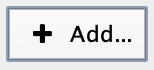

.. |trash_button| image:: images/create_dialog/trash_button.png
   :width: 25px

Creating Data Sets by Scanning For Files
~~~~~~~~~~~~~~~~~~~~~~~~~~~~~~~~~~~~~~~~

The first step is to enter the paths to the data set files. This can be a time consuming process 
if done manually; for that reason EnrichmentMap has the ability to scan a folder and automatically 
detect enrichment, expression, class and GMT files. These files are automatically assembled into 
data sets based on naming conventions. This scanning process works well for GSEA because 
GSEA outputs a folder of results files.

To scan a folder click the |add_button| button and select **Scan folder for data sets to add**, 
then choose folder that contains the data files. If EnrichmentMap can 
detect data files it will automatically add one or more data sets to the list. You can also 
Drag-and-Drop folders onto the Data Set List to initiate a scan.

Scanning is based on a heuristic that may change between versions of EnrichmentMap,
so please check that the file entry panel contains the correct files after scanning.

.. _scanning:

Scanning Heuristic
~~~~~~~~~~~~~~~~~~

Folder structure:

 * A root folder is chosen to be scanned. 
 * Sub-folders under the root folder will also be scanned one level deep.
 * Files from different sub-folders will not be grouped into the same data set. 
 * A sub-folder may contain files for more than one data set.
 * GSEA outputs a folder of results files. Each of these will result in one GSEA data set.

The type of each file is decided based on the following assumptions:

 * File names ending with '.gct' are rank files.
 * File names ending with '.rnk' are rank or expresion files depending on the file format.
 * File names ending with '.gmt' are GMT files.
 * File names ending with '.xls', '.bgo', '.tsv' or '.txt' are likely enrichment files, but may be expression files.
   The contents of the file will be scanned to determine the type of enrichment file (eg GSEA, DAVID, BiNGO etc)
 * File names containing 'expr' or 'expression' are expression files.
 * Files containing columns of numbers are likely rank or expression files depending on the file contents.
 * File names containing 'rank' are rank files.
 * File names containing 'class' are class files.

Grouping individual files into data sets:

 * When a folder contains files for more than one data set they will automatically grouped into data sets.
 * Grouping is based on the similarity of the file names.

If the scanner is having trouble grouping your files into data sets try the following:

 * Use words like 'rank', 'expression' and 'class' in the file name to make it clear the type of each file.
 * Files that should be in the same data set can share a common prefix.
 * Files that should be in the same data set can be grouped into separate sub-folders under the same root folder.

Creating Data Sets Manually
~~~~~~~~~~~~~~~~~~~~~~~~~~~

To manually create a data set click the |add_button| button and select **Add data set manually**. 
A new data set will appear in the list and all the file input fields for that data set will be empty. 

To delete a data set select it in the list and then click the |trash_button| button.

2) File Entry Panel
-------------------

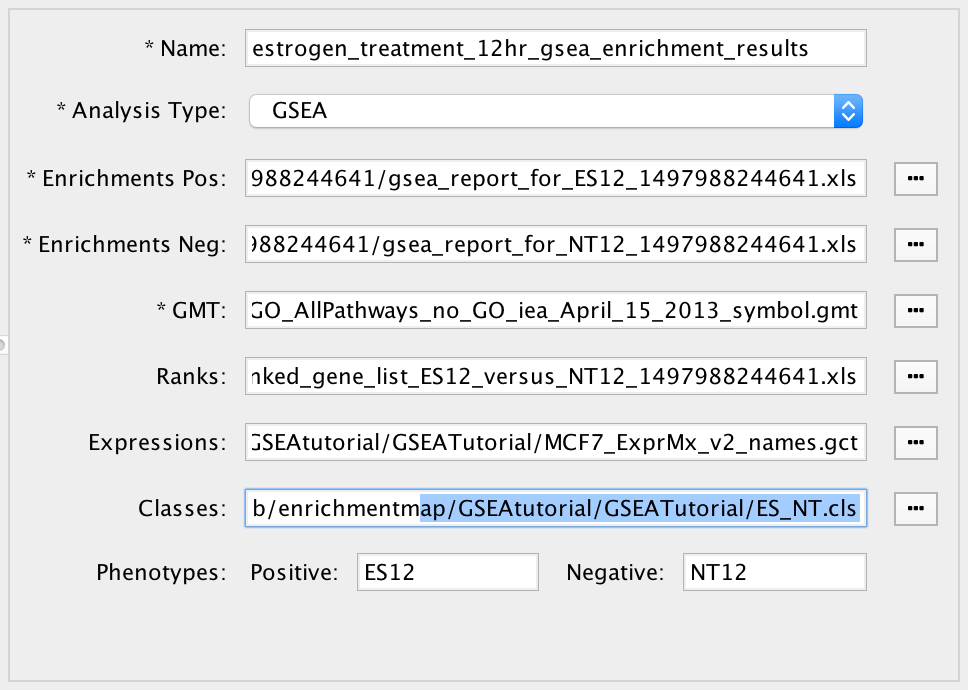

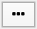

The file entry panel has the following fields:

* Data set name

  * The data set can be named anything. However two data sets may not have the same name.
    When scanning for files a name will be automatically chosen based on the file name of 
    the enrichment file(s).

* Analysis type

  1. GSEA

     * Takes as inputs the output files created in a GSEA analysis. When GSEA is chosen there will
       be two input fields for enrichment files. GSEA analysis always has two enrichment results 
       files, one for each of the phenotypes compared.

  2. Generic/gProfiler

     * Takes as inputs the same file formats as a GSEA analysis except the Enrichment results 
       file is a different format and there is only one enrichment file.

  3. David/BiNGO/Great

     * Has no GMT or expression file requirement and takes as input enrichment result file as 
       produced by DAVID, BiNGO or GREAT tools.

* File input fields

  * There are input fields for Gene Set, Enrichment, Expression, Rank and Class files. Fields
    with a * next to their name are required, all other fields are optional. Which fields
    are required depends on the analysis type.
  * Click the |browse_button| button next to an input field to open a file browser.

* Phenotypes

  * Enter the names of two classes from the class file that are being compared in the enrichment analysis.
    When a class file is entered the dialog will parse the class file and automatically fill in these fields.
  * These phenotypes will be highlighted in the :ref:`heat_map_panel`.

.. note:: See :ref:`file_formats` for details on the various file formats 
          accepted by EnrichmentMap.

Common Files
~~~~~~~~~~~~

Click the |add_button| button and select **Add common files**. 

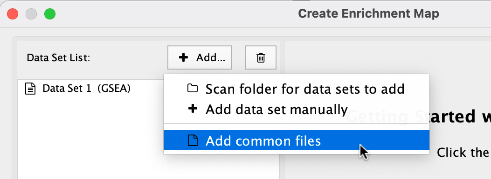

Select *Common Files* at the top of the data set list to show a special file entry panel. 
GMT, expression and class files entered on this panel will be included in all the data sets.

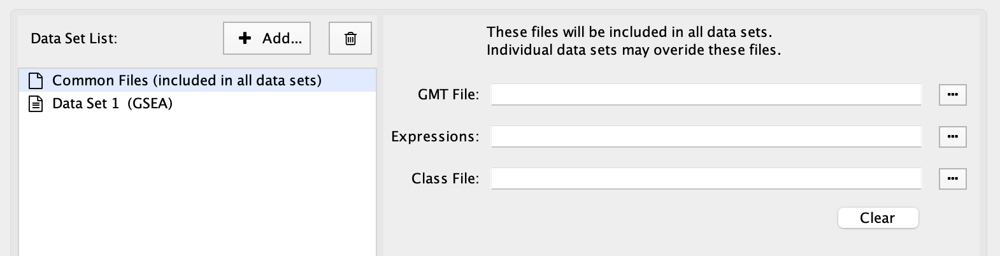

Files on the *Common Files* panel will override files entered in the individual data set panels.

Click the **Clear** button to clear out all three file input fields.

.. note:: Even though *Common Files* is located inside the data set list it is not a data set.

3) Network Name
---------------

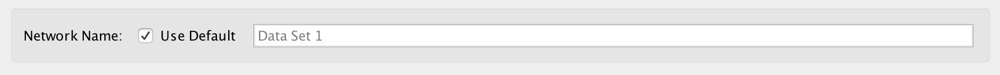

EnrichmentMap will automatically generate a name for the network based on the name of the 
first data set in the list. 

If you want to choose your own name for the network de-select the **Use Default** checkbox
then enter the name.

The name of the network can always be changed after it has been created. Go to the **Network** tab,
right click the network name, and select **Rename Network**.

4) Gene Set (Node) Filtering
----------------------------

Gene sets must pass the following criteria to be included in the network.

Basic Options
~~~~~~~~~~~~~

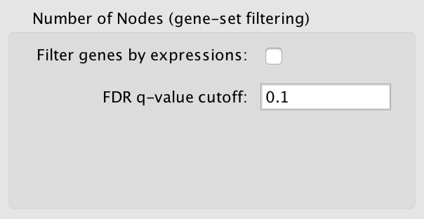

* Filter gene sets by expressions

  * If selected genes that are contained in the gene set (GMT) files or the enrichment files, 
    but are not contained in the expression files will not be included in the network.

* FDR q-value cutoff

  * Gene set with a q-value lower than the one entered will not be included in the network.

Advanced Options
~~~~~~~~~~~~~~~~

Available when the **Show Advanced Options** checkbox at the bottom right of the dialog is selected.

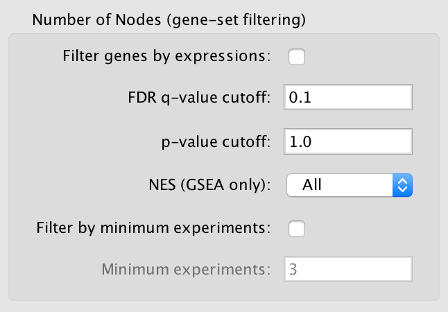

* p-value cutoff

  * Gene sets with a p-value lower than the one entered will not be included in the network.
  * The default value of 1.0 will not cause any gene sets to be removed from the network.

* NES (GSEA only)

  * Positive: Only gene sets from the positive enrichment file will be included.
  * Negative: Only gene sets from the negative enrichment file will be included.
  * All: Both enrichment files will be included

* Filter by minimum experiments
 
  * Selected this to enable the *Minimum experiments* field.

* Minimum experiments

  * A gene set must be included in this many data sets to be included in the network.

.. note:: See :ref:`parameters` for more details on how to tune gene set filtering.

5) Gene Set Similarity (Edge) Filtering
---------------------------------------

A similarity score is computed for every pair of gene sets based on how many genes they have 
in common (set intersection). If the similarity score passes the following criteria then an edge 
will be created between the gene set nodes.

Basic Options
~~~~~~~~~~~~~

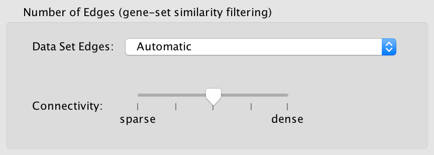

* Data set edges (Note: This option has no effect if there is only one data set)
 
  * Separate edge for each data set

    * If a gene set is associated with more than one data set it is possible for the contents of the gene set to be
      different in each data set. This often happens when the data sets have different
      expression files and the *"filter gene sets by expressions"* option is enabled. 
      A separate similarity score will be computed for each data set resulting in potentially many more 
      edges and a much denser network.  

  * Combine edges across data sets

    * Gene sets with the same name are combined (set union) and then the similarity score is calculated.
    * There will be at most one edge between a pair of gene set nodes.

  * Automatic *(default)*

    * EnrichmentMap decides which of the above options to use.
    * If there are exactly two data sets and they have different expression files then *separate edges* 
      is chosen, otherwise *combine edges* is chosen. This is done to be consistent with the behavior
      of EnrichmentMap 2.0.

* Connectivity

  * Moving the slider towards *sparse* will produce fewer edges, moving it towards *dense* will produce
    more edges.

Advanced Options
~~~~~~~~~~~~~~~~

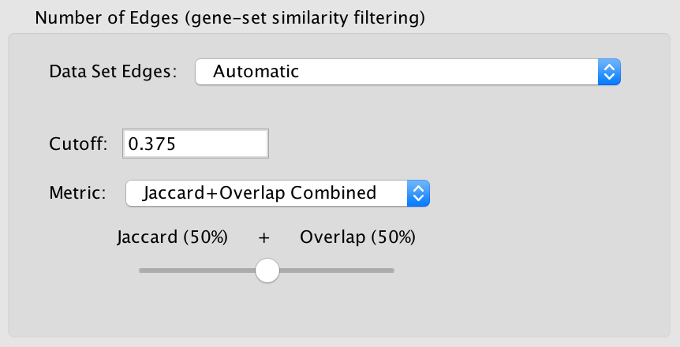

When *show advanced options* is enabled the *Connectivity* slider is replaced with options that allow 
greater control over the number of edges in the network.

* Cutoff
  
  * Edges with a similarity score lower than the one entered will not be included in the network.

* Metric

  * Used to choose the formula used to calculate the similarity score.

  * Jaccard Coefficient

    ::

      Jaccard Coefficient = [size of (A intersect B)] / [size of (A union B)]

  * Overlap Coefficient

    ::

      Overlap Coefficient = [size of (A intersect B)] / [size of (minimum( A , B))]

  * Combined

    * Merges the Jaccard and Overlap coefficients.
    * When selected a slider appears allowing to adjust the percentage of each coefficient to use.

.. note:: See :ref:`parameters` for more details on how to tune gene set filtering.

6) Action Buttons
-----------------

* Reset

  * Clears out and resets all fileds to their defaults.

* Show Command

  * Opens a pop-up dialog that shows an automation command based on the values entered into the Create
    EnrichmentMap Dialog. The command can be used in a script to automate the creation of an
    EnrichmentMap network.

* Build

  * Creates the EnrichmentMap network.
  * First runs validation on the inputs. If there are any problems (eg. required fields missing, 
    duplicate data set names) a error dialog is shown. The problems must be fixed before the network
    can be created.
  * This is a potentially long running task.

* Cancel

  * Close the dialog without creating a network.

