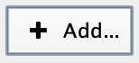
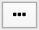

.. _creating_network_gmt:

Creating a Network from a GMT file
==================================

It is possible to create a network from just a single GMT (gene set database) file.

For more information on the format of GMT files and on how to download Baderlab
GMT files see :ref:`gene_sets`.

.. warning:: When importing a GMT file on its own there are no
             enrichment scores to use to filter the network, so all the gene sets in the
             file will be included in the network. If the GMT file is large this
             can result in a very large and highly connected network.

Open the **Create EnrichmentMap Dialog** by going to the Cytoscape main menu and selecting **Apps > EnrichmentMap**.

.. image:: images/quicktour/menu.png
   :width: 50%

Click the |add_button| button and select **Add data set manually**.

This will create a new data set named *Data Set 1*.

In the **Analysis Type** combo box select **Generic**.

Click the **Browse** button |browse_button| next to the **GMT** field
and select the file to use.

It is recommended that under the **Number of edges** section to set the
slider to **sparse**. Otherwise it is likely to get a network that is 
too highly connected.

Click the **Build** button to create the network.

