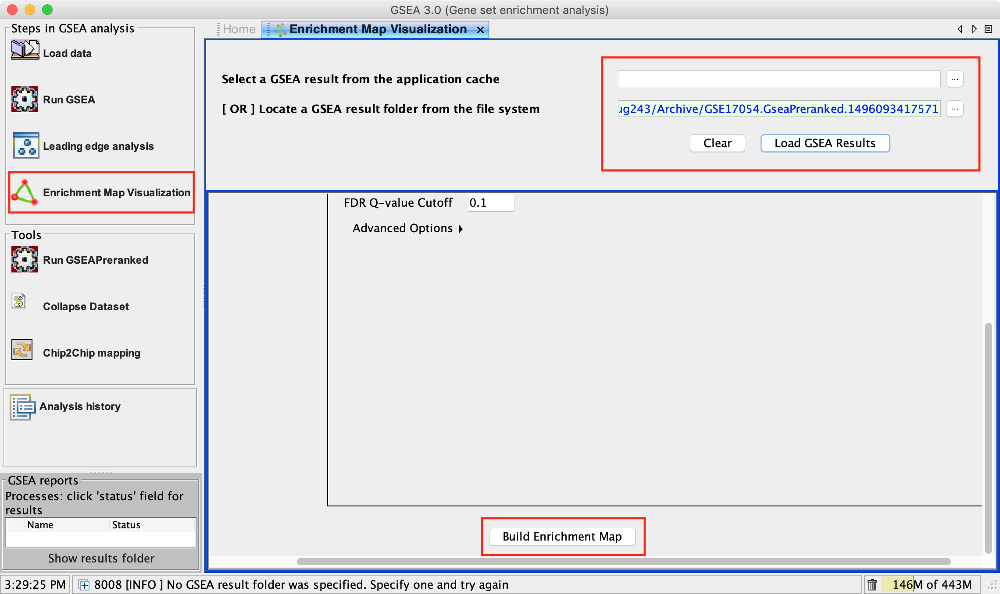
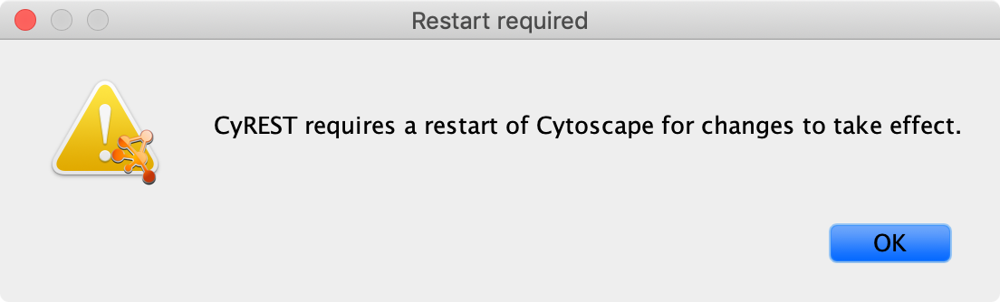

.. _gsea:

GSEA Integration
================

An EnrichmentMap network can be created directly from the javaGSEA desktop application.

* `Download javaGSEA desktop <http://software.broadinstitute.org/gsea/index.jsp>`_

Opening EnrichmentMap from javaGSEA
-----------------------------------

The following steps require a completed GSEA analysis.

1. Click the **EnrichmentMap Visualization** button. 

   * This will automatically launch Cytoscape if it is not already open.
   * Please wait for Cytoscape to finish loading before attempting to create a network.

.. warning:: If you have multiple versions of Cytoscape installed GSEA will attempt to launch the latest version.
             However there is an issue in GSEA where sometimes it launches the wrong version. You may need to
             uninstall the older versions of Cytoscape in order to get GSEA to launch the correct version.

.. warning:: Newer versions of Cytoscape will sometimes display a popup on startup that says 
             "CyREST requires a restart of Cytoscape for changes to take effect." When this popup is displayed
             Cytoscape must be restarted or else GSEA will not be able to create an EnrichmentMap network.

             |crest_warn|

2. Navigate to the analysis or analyses you wish to create an EnrichmentMap for. 
   There are two ways to do this:
   
   * Click on the ... button next to *Select a GSEA result from the application cache*. 
     From the list select the set of analyses to load. (hold down CTRL or COMMAND key to select multiple analyses). 
     Click OK. 
   * Click on the ... next to *[OR] Locate a GSEA result folder from the file system*. 
     Navigate to the GSEA result directory you wish to use. Click OK.

3. Click on Load GSEA Results.

4. Bottom frame will appear, auto-populating file fields according to the GSEA results folders specified. 
   Multiple GSEA folders can be specified. If more than one folder is specified bottom frame will contain 
   specifications for two datasets. If only one directory is specified then only one dataset will be accommodated.

5. The user can specify which of the datasets to use as DataSet 1 by selecting dataset from drop down list. Selecting a 
   different dataset will automatically populate Expression(Dataset 1) with the corresponding expression file.

6. If you have conducted a GSEA analysis on a Preranked list of genes but wish to see the original expression 
   file associated with your enrichment map update the path to the expression file next to Expression (Dataset 1).

7. The user can specify which of the datasets to use as dataset 2 by selecting dataset from drop down list. 
   Selecting a different dataset will automatically populate Expression(Dataset 2) with the corresponding expression file.

8. If you have conducted a GSEA analysis on a Preranked list of genes but wish to see the original expression 
   file associated with your enrichment map update the path to the expression file next to Expression (Dataset 2).

9. Tune Parameters. See :ref:`parameters`.

   * P-value cut-off: 0.001
   * Q-value cut-off: 0.05
   * Overlap coefficient cut-off: 0.5

10. Click on Build Enrichment Map

11. Cytoscape should launch and create your Enrichment map.
