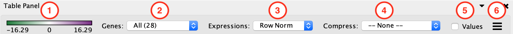
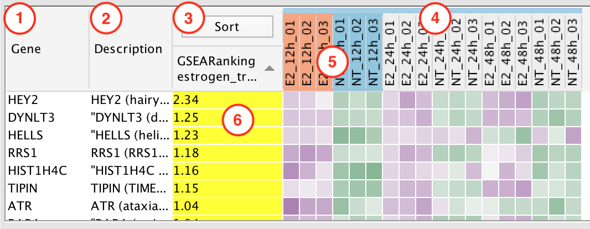
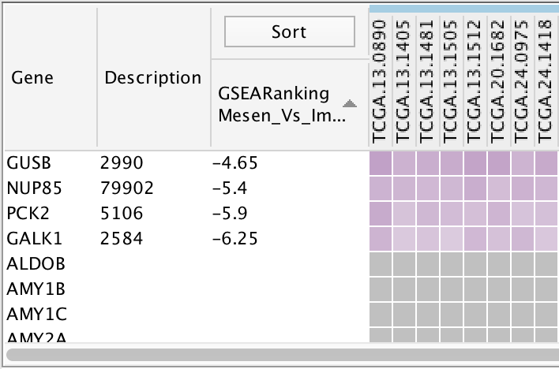
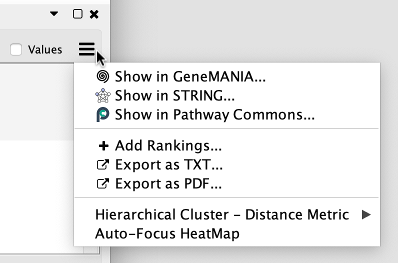

.. _heat_map_panel:

Heat Map Panel
==============

The Heat Map panel shows expression values for genes that are associated with selected
nodes and edges. 

You may select any number of nodes and/or edges in the network.
Selecting an edge is equivalent to selecting the two gene set nodes that are connected to the edge.

.. note:: "Where are my expression values?"
          
          If there are more than 50 expression values per gene then the *Compress: Data Set Median* option
          will be automatically enabled. Set Compress to *--None--* to see the original values.
          See below for more details.

Toolbar
-------

1. Expression Legend

   * Click on an expression value cell in the table to show the Expression Legend. It will not be visible
     until a value is selected.
   * Shows the value range and the color gradient for the data set associated with the selected 
     expression value. Note the value range may be different for different data sets.

2. Genes

   * All

     * Shows all of the genes from all of the selected gene sets (union).
    
   * Common

     * Shows only genes that are common to all selected gene sets (intersection).

3. Expressions

   * Values

     * Shows the raw values from the expression file(s). Expression values are rounded to 
       two decimal places.

   * Row Norm

     * Row normalizes the expression values. For each value in a row of expression the mean 
       of the row is subtracted followed by division by the row's standard deviation.

   * Log

     * Takes the log of each expression value.

4. Compress

   * -None-

     * Shows all of the expression values.

   * Class: Median, Min, Max

     * Only available if a class file was provided when the network was created.
     * Shows a single column for each class where the value is the median, min or max of the values
       in the class.

   * Data Set: Median, Min, Max

     * Shows a single column for each data set where the value is the median, min or max of all the
       values.
     * If the number of expressions per gene is greater than 50 then *Compress: Median* will be 
       automatically enabled.

5. Values

   * When disabled only the color gradients are shown. When enabled the numeric expression values are shown.
   * Expression values are rounded to two decimal places.

6. Menu button

   * Opens the panel options menu.

Table
-----

Click on any of the column headers to sort the table by that column.

1. Gene Column
2. Description Column
3. Sort Column

   * This column is used to sort by ranks or by hierarchical clustering.
   * Click the **Sort** button to show a menu of ranking options.
   * |sort_menu|
   * If a data set has a rank file then the ranks will be listed in the menu.
   * See `Panel Menu`_ below for details on how to load additional rank files.
   * Hierarchical Clustering: Genes are clustered using a hierarchical clustering algorithm based on
     their expression values, the resulting hierarchy is then used to sort the genes.

4. Expression Columns

   * Shows expression values for each experiment.
   * If there is more than one data set and each data set has common expression values then the values
     will only be shown once.
   * If there are two or more data sets and they have different expression values then all the expression
     values are shown.

     * A colored bar that runs along the top of the expression column headers can be used to differentiate
       between the data sets. The color of the bar corresponds to the color shown next to the data set
       name in the main panel.
    
       |panel_colors| 

       |table_colors|

   * Genes that do not have expression data are shown in gray.

     |expression_grey|

5. Phenotype Highlight

   * The phenotypes that were entered in the *Create EnrichmentMap Dialog* are highlighted.

6. Leading Edge

   * Genes that are part of the leading edge are highlighted in yellow.
   * Available for GSEA results when a single gene set is selected.
   * See below for more details.

GSEA Leading Edge
-----------------

For every gene set that is tested for significance using GSEA there is a set of proteins in that 
gene set defined as the Leading Edge. According to GSEA the leading edge is:

    *“The subset of members that contribute most to the ES. For a positive ES, the 
    leading edge subset is the set of members that appear in the ranked list prior 
    to the peak score. For a negative ES, it is the set of members that appear 
    subsequent to the peak score.”*

In essence, the leading edge is the set of genes that contribute most to the enrichment of the gene set.

For Enrichment Map, leading edge information is extracted from the GSEA enrichment results 
files from the column denoted as *Rank at Max*. Rank at max is the rank of the gene where the 
ES score has the maximal value, i.e. the peak ES score. Everything with a better rank than 
the rank at max is part of the leading edge set.

.. _heat_map_menu:

Panel Menu
----------

.. MKTODO, the Export has changed to add more columns in 3.1, and the dialog is different.

* Show in GeneMANIA...

  * Creates a GeneMANIA network from the list of genes currently selected in the Heat Map.
  * See :ref:`integration_genemania` for more details.

* Show in STRING...

  * Creates a STRING network from the list of genes currently selected in the Heat Map.
  * See :ref:`integration_string` for more details.

* Show in Pathway Commons...

  * Opens a web browser and creates a network on the Pathway Commons painter website.
  * See :ref:`integration_pc` for more details.

* Add Rankings

  * Opens a pop-up dialog that allows you to load an additional rank file. 
  * See `Add Ranks Dialog`_ below for more details.

* Export as TXT

  * Export the expressions currently being viewed in the heat map table as a tab-separated 
    text file. The first line of the file contains the table headers.
  * If the heat map is showing the leading edge then you will be prompted
    to save just the genes that are part of the leading edge or all the genes.

* Export as PDF

  * Export the the expressions currently being viewed in the heat map table as a PDF file.
  * The visual state of the table is reflected in the PDF file. For example to show the expression values
    in the PDF file enable the *show values* option in the toolbar.

* Hierarchical Cluster - Distance Metric

  * Allows to select the distance metric used by the hierarchical cluster algorithm.

* Auto-Focus HeatMap

  * If enabled then every time a node/edge is selected the HeatMap panel will be 
    brought to the front.
  * Disabled by default.

Add Ranks Dialog
----------------

Used to load additional ranks files into an existing data set. 