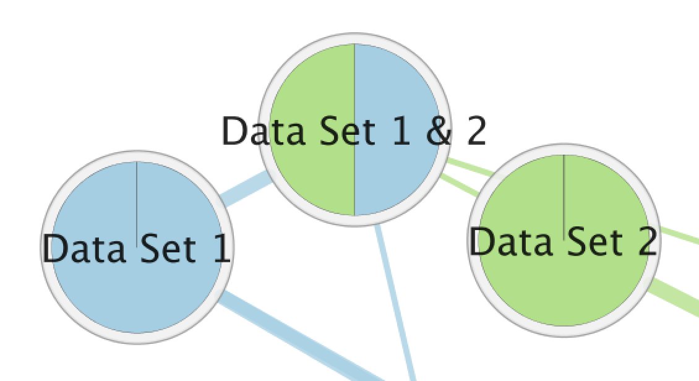

.. _integration:

Creating Networks in Other Apps
===============================

The genes in an EnrichmentMap network can be used to create a new network in the following tools:

* The GeneMANIA Cytoscape App
* The STRING Cytoscape App
* The Pathway Commons website

Start by selecting some nodes or edges in the EnrichmentMap network. The list of genes
associated with the selected gene sets will be shown in the :ref:`heat_map_panel`.
The panel menu can then be used create a new network from the list of genes shown in the Heat Map.

.. _integration_genemania:

GeneMANIA
---------

* `GeneMANIA Documentation <https://apps.cytoscape.org/apps/genemania>`_
* `GeneMANIA on the Cytoscape App Store <http://pages.genemania.org/cytoscape-app/>`_

To create a GeneMANIA network in Cytoscape select *Show in GeneMANIA...* in the Heat Map panel menu.
If the GeneMANIA Cytoscape App is not yet installed you will be prompted to install it.

A dialog for entering GeneMANIA parameters will be shown. Enter the parameters and click OK.
A GeneMANIA network will be created where each node represents a single gene.

It is possible to view gene expression data for the genes in the GeneMANIA network. 
See the section `Working with Associated Networks`_ below for more details.

.. _integration_string:

STRING
------

* `stringApp on the Cytoscape App Store <https://apps.cytoscape.org/apps/stringapp>`_
* `stringApp Documentation <http://www.cgl.ucsf.edu/cytoscape/stringApp/index.shtml>`_
* `stringApp Tutorial <https://jensenlab.org/training/stringapp/>`_

To create a STRING network in Cytoscape select *Show in STRING...* in the Heat Map panel menu.
If the stringApp Cytoscape App is not yet installed you will be prompted to install it.

A dialog for entering STRING parameters will be shown. Enter the parameters and click OK.
A STRING network will be created where each node represents a single gene.

It is possible to view gene expression data for the nodes in the STRING network. 
See the section `Working with Associated Networks`_ below for more details.

Working with Associated Networks
--------------------------------

GeneMANIA and STRING networks that were created from an EnrichmentMap network are linked
to the EnrichmentMap main panel and in the Heat Map panel.

1. GeneMANIA and STRING associated networks can be selected from the network combo box in the main panel.
   They are listed below the EnrichmentMap network they were created from.

2. When an associated network is selected the main EnrichmentMap panel changes to show 
   chart data options.

3. Selecting nodes in the Associated network causes the expression data for those genes
   to be shown in the Heat Map panel. Each node represents a single gene.

4. The Heat Map panel shows the expression data for the selected nodes in the associated network.

Data Charts
~~~~~~~~~~~

The chart settings are available from the main EnrichmentMap panel.

* **Chart Data**

   * Color by Data Set

     * Pie chart that shows which data sets each gene set is a member of.
     * When this option is selected the rest of the fields are disabled.

       +--------------------+
       | Color by Data Set  |
       +--------------------+
       | |chart_ds|         |
       +--------------------+

   * Color by Expression Data

     * The expression data for individual genes can be visualized on each node using this chart.
     * Each node in an associated network represents a single gene.
     * There are 2 charts available for visualizing expression values.
     * The segments of the Radial Heat Map chart start at the 12 o'clock position and proceed clockwise.

       ===============  ===============
       Radial Heat Map  Heat Strips 
       ===============  ===============
       |chart_radial|   |chart_strips|      
       ===============  ===============

* **Expressions**

   * Values

     * Shows the raw values from the expression file(s). Expression values are rounded to 
       two decimal places.

   * Row Norm

     * Row normalizes the expression values. For each value in a row of expression the mean 
       of the row is subtracted followed by division by the row's standard deviation.

   * Log

     * Takes the log of each expression value.

* **Compress**

   * -None-

     * Shows all of the expression values.

   * Class: Median, Min, Max

     * Only available if a class file was provided when the network was created.
     * Shows a single column for each class where the value is the median, min or max of the values
       in the class.

   * Data Set: Median, Min, Max

     * Shows a single column for each data set where the value is the median, min or max of all the
       values.

* **Data Set**

  * When there is more than one data set it is necessary to select which data set to use for the expression values.

.. note:: The expression data visualized on the network using charts is the same expression data found in the Heat Map panel.
          However the options for *Expressions* and *Compress* are set separetely. If you want the expression data shown on the charts
          to match what is shown in the Heat Map panel make sure you have selected the same options for *Expresssions* and *Compress*
          in both places.

.. _integration_pc:

Pathway Commons Painter
-----------------------

To create a network on the Pathway Commons website select *Show in Pathway Commons...* in the Heat Map panel menu.

The selected genes and their expression data will be sent to the Pathway Commons painter website.
A web browser will be opened with the associated genes. 
The panel on the right can be used to visualize expression data on the network.s

