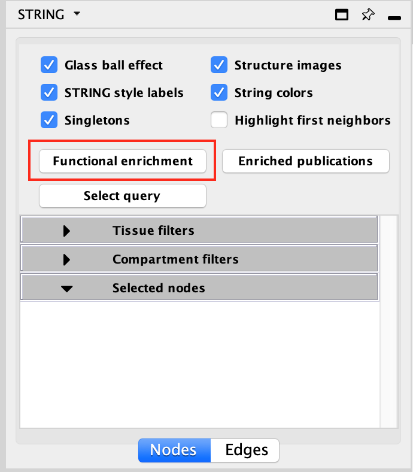

Creating Networks from Other Apps
===============================================

Enrichment data stored in networks created by the GeneMANIA and STRING apps can be
used to create EnrichmentMap networks.

GeneMANIA
---------

Start by selecting a network that was created using the GeneMANIA app. Go to the 
EnrichmentMap main panel, click the menu button, and select *Create from GeneMANIA*.

.. image:: images/integration/create_from_genemania.png

STRING
------

Start by selecting a network that was created using the STRING app.

Before creating an EnrichmentMap network you must run *functional enrichment* task from the
STRING side panel. This will add the necessary enrichment data to the STRING network.

The enrichment data will show up in the bottom table panel.

Now go to the EnrichmentMap main panel, click the menu button, and select *Create from STRING*.

