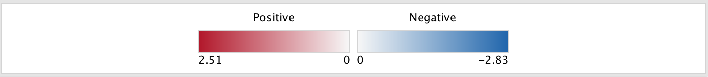

.. _legend_dialog:

Legend Dialog
=============

.. image:: images/legend/legend.png
   :width: 70%

The legend dialog provides a legend for the current network visualization.

The legend dialog can be left open. It will update automatically when
changes are made to the network visualization using the :ref:`style_section`
of the main panel.

Sections
--------

Node Color
~~~~~~~~~~

* Enabled when there is one data set and chart data is set to none.
* Shows the range for the node fill color gradient.

Node Shape
~~~~~~~~~~

* Shows the meaning of node shape.
* Shows signature nodes after post analysis has been run.

Node Chart
~~~~~~~~~~

* Shows the meaning of the node charts.
* Shows how the chart segments map to the data sets.

Node Chart Colors
~~~~~~~~~~~~~~~~~

* Shows the color range for the chart segment color gradients.

Edge Color
~~~~~~~~~~

* Shows how edge color maps to data sets.

Creation Parameters
-------------------

Click the **Creation Parameters** button at the bottom left of the dialog to open the Creation Parameters dialog.
This dialog shows the parameters that were originally entered in the *Create EnrichmentMap Dialog* 
when the network was originally created.

