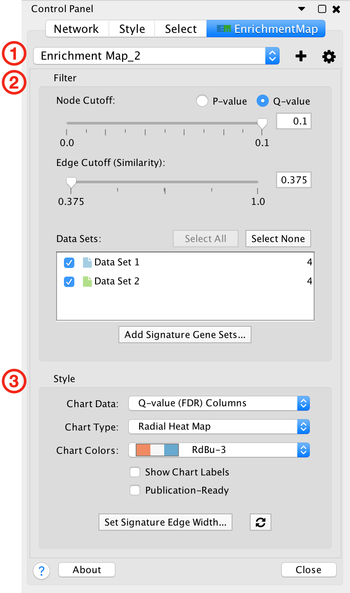
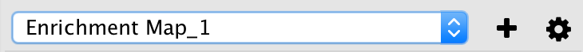
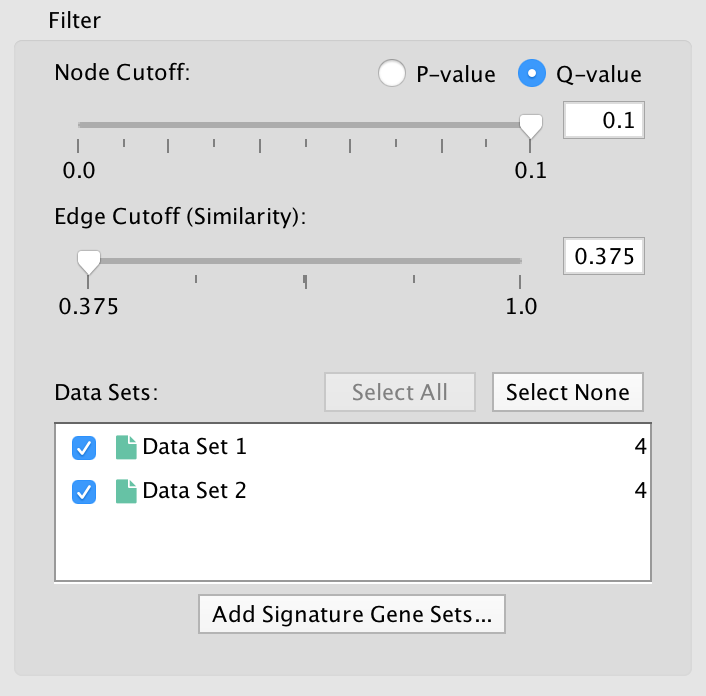
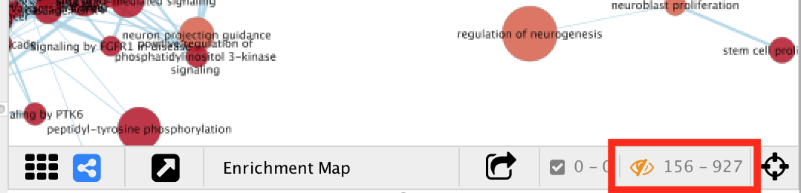
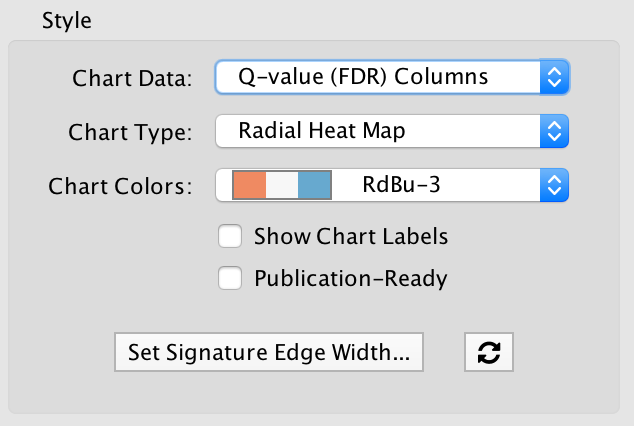

.. _main_panel:

Main Panel
==========

The main EnrichmentMap panel has the following sections:

1. Toolbar
2. Filter section
3. Style section

Each of these sections will be explained in more detail below.

If the main panel is not visible go to the Cytoscape main menu and select **Apps > EnrichmentMap**.

To hide the panel click the **Close** button at the bottom right.

Toolbar
-------

* Network combo box

  * This combo box can be used to quickly switch between EnrichmentMap networks without having
    to navigate to the *Network* tab. Only networks created by EnrichmentMap are listed. 

* Plus button |plus_button|

  * Opens the *Create EnrichmentMap Dialog*.

* Gear button |gear_button|

  * Opens the panel menu (explained in more detail below).

Filter Section
--------------

The filter section is used to hide nodes and edges in the network.

* Node cutoff

  * Use the radio buttons to switch between p-value and q-value.
  * The slider is initially set all the way to the right, which corresponds to the value that was entered
    in the *Create EnrichmentMap Dialog* when the network was created. 
  * As the slider is moved to the left nodes with a p-value/q-value greater than the cutoff are hidden.
    Edges connected to hidden nodes are also hidden.
  * P-values can be found in the *Node Table* in columns that start with *EM#_pvalue*.
  * Q-values can be found in the *Node Table* in columns that start with *EM#_fdr_qvalue*.

* Edge cutoff

  * This slider is initally set all the way to the left, which corresponds to the smallest edge similarity
    score in the network.
  * As the slider is moved to the right edges with a similarity score less than the cutoff are hidden.
  * Similarity scores can be found in the *Edge Table* in the column named *EM#_similarity_coefficient*.

* Data Sets list

  * The data set list shows then names of all the data sets as well as the number of gene sets in each data set.
  * Initially the checkbox next to each data set is selected.
  * De-selecting the checkboxes hides gene set nodes that are only contained in those data sets.

* Add Signature Gene Sets button

  * Click to open the :ref:`post_analysis` dialog.

The number of hidden nodes and edges can be seen in the status bar under the network view.

 
.. _style_section:

Style Section
-------------

The style panel is mainly used to manipulate chart visualizations on nodes.

For more details on chart visualizations see :ref:`chart_visualization`.

* Chart Data

  * -- None --

    * If there is 1 data set then node shows a pre-computed color gradient for the p-value. 
      If there are 2 or more data sets then the node color has no meaning and is set to grey.

  * NES Columns

    * Enrichment values from the *EM#_NES* columns are used.
    * Only available if the analysis type is GSEA.

  * P-value Columns

    * Enrichment values from *EM#_pvalue* columns are used.

  * Q-value (FDR) Columns

    * Enrichment values from *EM#_fdr_qvalue* columns are used.

* Chart Type

  * Field is enabled if *Chart Data* is set to a value other than *-- None --*.
  

