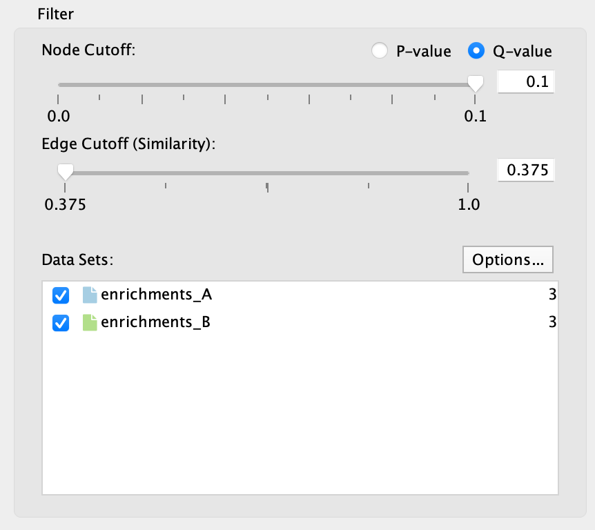

   :align: right

.. _main_panel:

Main Panel
==========

The main EnrichmentMap panel has the following sections:

1. Toolbar
2. Filter section
3. Style section

Each of these sections will be explained in more detail below.

If the main panel is not visible go to the Cytoscape main menu and select **Apps > EnrichmentMap**.

To hide the panel click the **Close** button at the bottom right.

1) Toolbar
----------

.. |plus_button| image:: images/main_panel/plus_button.png
   :width: 20px

.. |refresh_button| image:: images/main_panel/refresh_button.png
   :width: 20px

* Network combo box

  * This combo box can be used to quickly switch between EnrichmentMap networks without having
    to navigate to the *Network* tab. Only networks created by EnrichmentMap are listed. 

* Plus button |plus_button|

  * Opens the *Create EnrichmentMap Dialog*.

* Gear button |gear_button|

  * Opens the panel menu (explained in more detail below).

Panel Menu
~~~~~~~~~~

.. |highlight| image:: images/main_panel/filter_highlight.png
   :width: 140px

.. |hide| image:: images/main_panel/filter_hide.png
   :width: 140px

* Show Legend
 
  * Opens the :ref:`legend_dialog`.

* Show Creation Parameters
  
  * Opens the :ref:`creation_parameters`.

* Create from Genemania...
  
  * Creates an EnrichmentMap network from annotation data stored in a Genemania network.

* Create from STRING...

  * Creates an EnrichmentMap network from enrichment data stored in a STRING network.

* Hide/Highlight filtered nodes and edges

  * Changes the appearance of nodes and edges that are filtered out. See `2) Filter Section`_ below.

============  ============  ============
No Filter     Highlight     Hide           
============  ============  ============
|none|        |highlight|   |hide|  
============  ============  ============

2) Filter Section
-----------------

The filter section is used to hide nodes and edges in the network.

* Node cutoff

  * Use the radio buttons to switch between p-value and q-value.
  * The slider is initially set all the way to the right, which corresponds to the value that was entered
    in the *Create EnrichmentMap Dialog* when the network was created. 
  * As the slider is moved to the left nodes with a p-value/q-value greater than the cutoff are hidden.
    Edges connected to hidden nodes are also hidden.
  * P-values can be found in the *Node Table* in columns that start with *pvalue*.
  * Q-values can be found in the *Node Table* in columns that start with *fdr_qvalue*.

* Edge cutoff

  * This slider is initially set all the way to the left, which corresponds to the smallest edge similarity
    score in the network.
  * As the slider is moved to the right edges with a similarity score less than the cutoff are hidden.
  * Similarity scores can be found in the *Edge Table* in the column named *similarity_coefficient*.

* Data Sets list

  * The data set list shows then names of all the data sets as well as the number of gene sets in each data set.
  * Initially the checkbox next to each data set is selected.
  * De-selecting the checkboxes hides gene set nodes that are only contained in those data sets.

* Options button: Opens a pop-up menu with options for working with Data Sets.

  * Change data set colors

    * Opens a color chooser pop-up for choosing the colors used for each data set. This will change
      the color of the network edges, colors of the 'Color by Data Set' chart, and the table header in the
      Heat Map panel.

  * Add Signature Gene Sets

    * Opens the :ref:`post_analysis` dialog.

  * Highlight data sets for selected nodes and edges

    * When selecting nodes or edges in the network the corresponding data sets will be highlighted. This makes
      it easy to know data set membership. Select this option to turn this feature on/off.

The number of hidden nodes and edges can be seen in the status bar under the network view.

.. image:: images/main_panel/hidden.png
   :width: 60%

 
.. _style_section:

3) Style Section
----------------

The style panel is mainly used to manipulate chart visualizations on nodes.

For more details on chart visualizations see :ref:`chart_visualization`.

* Chart Data

  * -- None --

    * If there is 1 data set then node shows a pre-computed color gradient for the p-value. 
      If there are 2 or more data sets then the node color has no meaning and is set to grey.

  * NES Columns

    * Enrichment values from the *NES* columns are used.
    * Only available if the analysis type is GSEA.

  * P-value Columns

    * Enrichment values from *pvalue* columns are used.

  * -log10(pvalue) Columns

    * Values from -log10(pvalue) columns are used.

  * -log10(pvalue)*sign(NES) Columns

    * Values from -log10(pvalue)*sign(nes) columns are used.

  * Q-value (FDR) Columns

    * Enrichment values from *fdr_qvalue* columns are used.

  * Color by Data Set

    * Pie chart that shows which data sets each gene set is a member of.

  * Phenotypes

    * Only available for `g:Profiler` 2-data set analysis.
    * The color gradient of each chart segment indicates the enriched phenotype.

* Chart Type

  * Field is enabled if *Chart Data* is set to *NES Columns*, *P-value Columns* or *Q-value Columns*.
  * Various chart types are available, for more details see :ref:`chart_visualization`.

* Color Scheme

  * Several `Color Brewer <http://colorbrewer2.org/#type=diverging&scheme=BrBG&n=3>`_ colorblind 
    safe palettes are available.
  * When *NES Columns* is chosen for Chart Data then the **RdBu-9** palette will be available.
    This palette is the same as the standard color gradient used in EnrichmentMap 2.0.

* Show chart labels

  * Enable this option to show enrichment values for each chart segment.

* Publication-Ready

  * Makes the network view ready for printing. Removes node labels and sets the network background
    to white.

* Show Legend button

  * Shows the legend dialog.

* Reset Style button

  * Resets the visual style.
  * Sometimes Cytoscape does not update the visual style properly. To fix any inconsistencies
    between the network view and the Style section of the main panel click this button.

* Find Clusters button

  * Uses the AutoAnnotate app to find clusters of highly similar nodes.
  * For more information see :ref:`clusters`.

