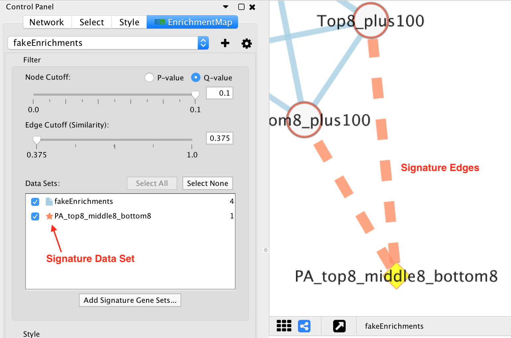

.. _em_network:

Network Visualization
=====================

.. image:: images/quicktour/network.png
   :width: 80%

Style
-----

EnrichmentMap creates a separate visual style for each network. 
The visual style has the following characteristics:

* Nodes represent gene sets.
* Node size represents the number of genes in the gene set.
* Edges represent overlap (similarity) between gene sets.
* Edge width represents the number of genes that overlap between a pair of gene sets. 

* Node fill represents enrichment scores, such as NES (for GSEA), p-value or q-value. 

  * When there is only 1 data set the enriched phenotype is conveyed using a color gradient.
  * When there are 2 or more data sets nodes are overlayed with charts, where each segment 
    of the chart shows enrichment using a color gradient.

The network is arranged by a force directed layout which causes gene sets with 
high overlap to cluster together.

Expression data is visualized in a separate panel called the Heat Map panel.
For more details see :ref:`heat_map_panel`.

Visual Properties
-----------------

.. warning:: EnrichmentMap automatically maintains the visual properties described below.
             If you manually change these visual properties EnrichmentMap will overwrite
             your changes. If you want to create a custom visual style you must first create a
             copy and then make changes to the copy.

Visual properties are available on the **Style** tab of the Control Panel.

Node Visual Properties
----------------------

.. |node_sig| image:: images/network/node_sig.png

There are two types of nodes:

  1. Enrichment gene set nodes

     * Regular gene set nodes that are created when the network is first created. 
     * Enrichment nodes can have many different visualizations depending on the 
       settings in the Style section of the :ref:`main_panel`.

  2. Signature gene set nodes

     * Added to an existing network by :ref:`post_analysis`.
     * Do not have chart visualizations.
     * Edges connected to signature nodes are dashed.

  ============ ============
  Enrichment   Signature
  ============ ============
  |node_enr|   |node_sig|
  ============ ============

Visual properties
~~~~~~~~~~~~~~~~~

=================  ===================  ====================  =========================================
Visual Property    Meaning              Type                  Column(s)
=================  ===================  ====================  =========================================
Shape              Gene Set Type        Discrete Mapping      EM#_GS_Type (ENR = Square, SIG = Diamond)
Fill Color         NES, p/q-value       Discrete Mapping      EM#_pvalue, EM#_fdr_qvalue, EM_NES
Label              Gene set name        Passthrough Mapping   EM#_GS_DESCR
Size               Size of gene set     Continuous Mapping    EM#_gs_size
Image/Chart 1      NES, p/q-value       Chart                 EM#_pvalue, EM#_fdr_qvalue, EM_NES
=================  ===================  ====================  =========================================

Edge Visual Properties
----------------------

If there are 2 data sets, and/or the *Separate edge for each data set* option
was chosen, then edges will have different colors for each data set. The edge color corresponds
to the color of the icon next to the data set name in the main panel.

If the network has only one data set, or if the *Combine edges across data sets* option was
chosen, then all the edges between enrichment gene sets will be the same color.

Edges connected to signature gene sets have a different color and are dashed.

Visual properties
~~~~~~~~~~~~~~~~~

================  ========================  ====================  ============================================
Visual Property   Meaning                   Type                  Column(s)
================  ========================  ====================  ============================================
Line Type         Edge Type                 Discrete Mapping      interaction (default = solid, sig = dashed)
Stroke Color      Data Set or Signature     Discrete Mapping      EM#_Data Set
Width             Size of gene set overlap  Continuous Mapping    EM#_similarity_coefficient
================  ========================  ====================  ============================================

.. _chart_visualization:

Chart Visualization
-------------------

There are 3 types of chart available for visualizing enrichment values.

===============  =============  =============
Radial Heat Map  Heat Map       Heat Strips 
===============  =============  =============
|chart1|         |chart2|       |chart3|
===============  =============  =============

Each segment of the chart is equal size and represents the enrichment value from one data set.
The color of each chart segment is a color gradient indicating the enrichment value. 
The default color scheme shows down-regulated scores in red and up-regulated scores in blue.

The legend dialog can be used to see which chart segment corresponds to which data set
and the color gradient.

Use the *Style* section of the :ref:`main_panel` to change the type chart and the color scheme.

