.. _post_analysis:

Post Analysis (Add Signature Gene Sets)
=======================================

The **Add Signature Gene Sets** panel allows you to add more gene sets to an existing network
(also called **Post Analysis**).  
This is done by calculating the overlap between gene sets of the current EnrichmentMap network 
and all the gene sets contained in the provided signature gene set file.

To open the *Add Signature Gene Sets Dialog* click the **Options** button on the main panel
and select **Add Signature Gene Sets...**

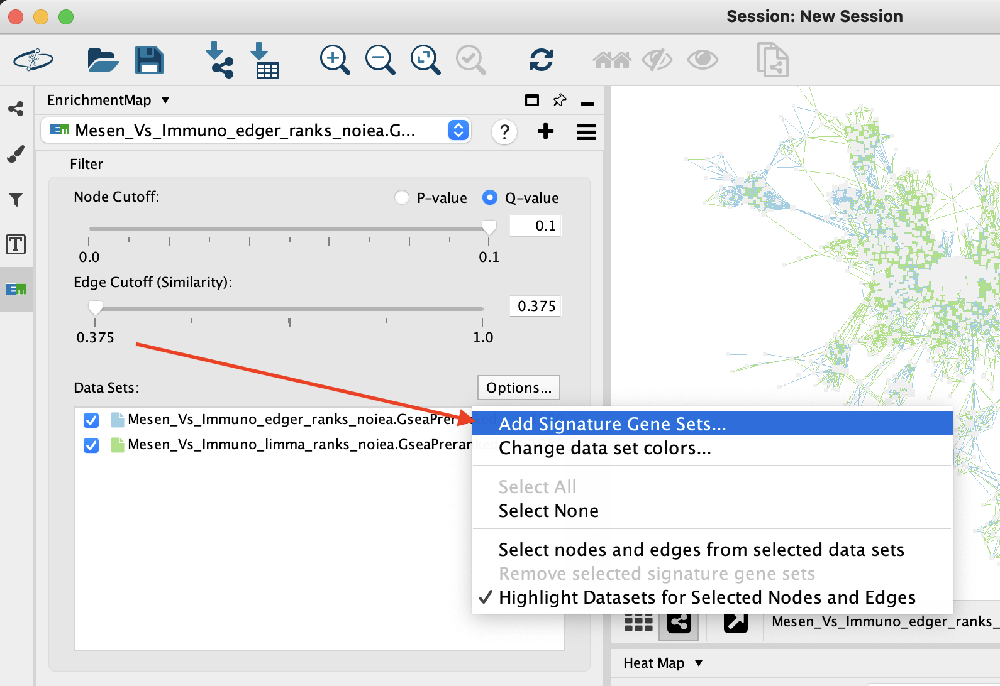

The result of running Post Analysis is a new node for each signature gene set (yellow triangle) 
and edges from the signature gene set to each existing gene set when the similarity passes the 
cutoff test. 

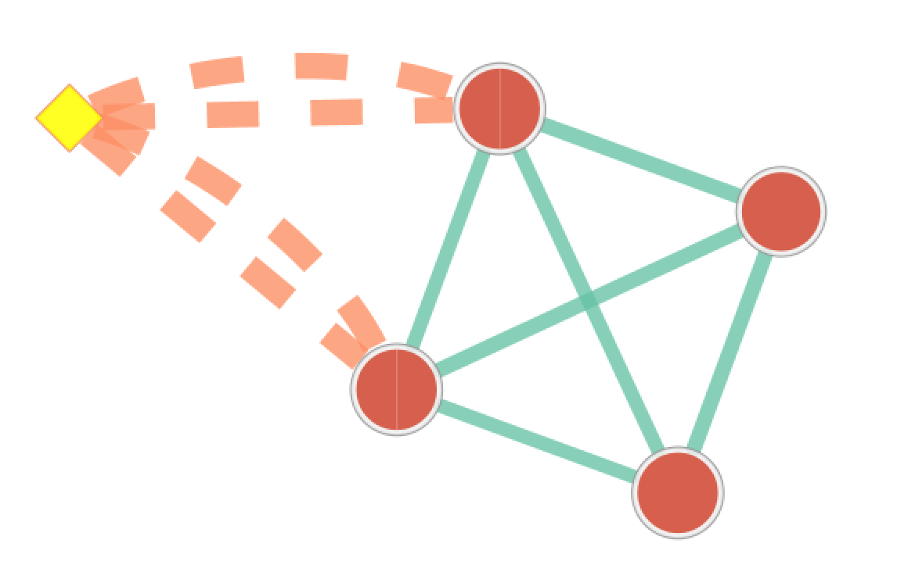

A new data set is added to the data set list on the Main panel. 
Signature data sets have a |star| next to their name.

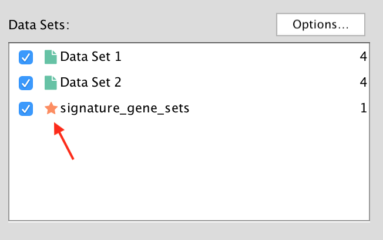

.. note:: The *Add Signature Gene Sets Dialog* has been redesigned for Cytoscape 3.1. There
          is no longer a distinction between *Known Signature* and *Signature Discovery*.

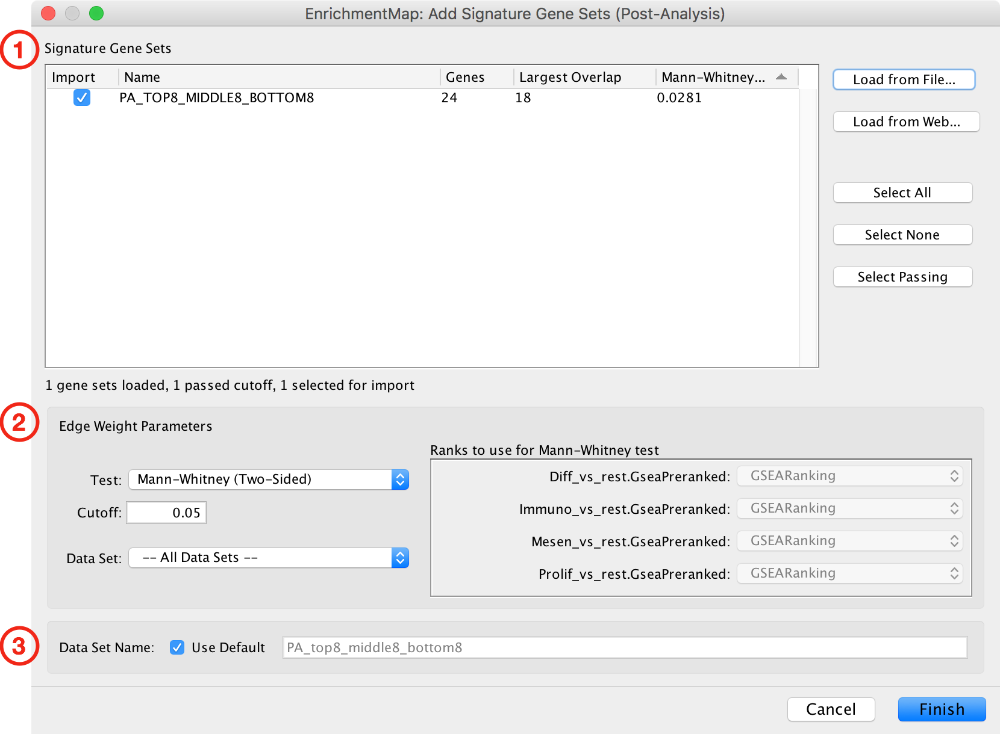

Add Signature Gene Sets Dialog
------------------------------

The *Add Signature Gene Sets Dialog* has the following sections:

1. Signature Gene Sets List
2. Edge Weight/Cutoff Parameters
3. Data Set Name

To close the dialog click the **Cancel** button. To
import signature gene sets click the **Finish** button.

1) Signature Gene Sets List
---------------------------

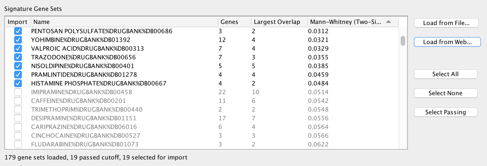

The Signature Gene Sets List allows you to preview and select the gene sets to import
into the network. The *Edge Weight* test is pre-computed for each gene set.

The table has the following columns:

* Import

  * Gene sets that are selected in this column will be imported into the network.
    The checkboxes in this column can be used to select or de-select individual gene sets.
  * You can also use the *Select All*, *Select None*, and *Select Passing* buttons to select
    multiple gene sets at once.

* Name

  * The name of the signature gene set.

* Genes

  * Number of genes in the signature gene set.

* Largest Overlap

  * The signature gene set is compared to every gene set in the network and the size of the largest
    overlap is displayed.

* Edge Weight (can be Mann-Whitney, Hypergeometric or Overlap)

  * The *Edge Weight* test is computed between the signature gene set and every gene set in the
    network and the largest result is displayed.
  * Can be Mann-Whitney, Hypergeometric or Overlap depending on what is currently selected
    in the *Edge Weight Parameters* panel below. 
  * Making changes in the *Edge Weight Parameters* panel causes the values in this column to be 
    automatically updated.

Loading Gene Sets
~~~~~~~~~~~~~~~~~

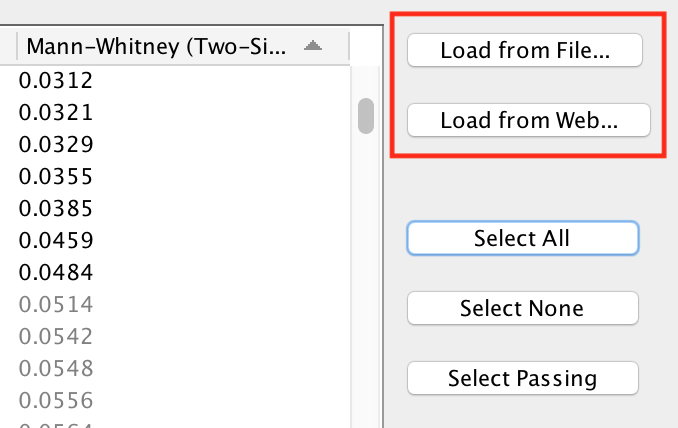

The **Load from File...** and **Load from Web...** buttons can be used to load a signature
gene set file.

* Load from File...

  * Opens a file browser to select a GMT file on the local file system.

* Load from Web...

  * Opens the **Load from Web** dialog. See below for more details.

Load from Web
~~~~~~~~~~~~~

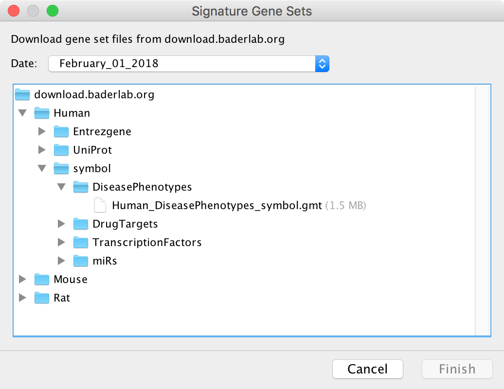

This dialog is used to select a GMT file on a remote server to download.
Currently the EnrichmentMap GMT files from 
`download.baderlab.org <http://download.baderlab.org/EM_Genesets/current_release>`_
are available. See :ref:`gene_sets` for more details on the contents of these GMT files.

Select a file and click **Finish** to start downloading. If the download is taking too long
it may be canceled at any time.

Selecting Gene Sets to Import
~~~~~~~~~~~~~~~~~~~~~~~~~~~~~

After loading the gene sets the ones that pass the *Edge Weight* cutoff are selected by default. 
Gene sets that do not pass the cutoff are de-selected and grayed out.

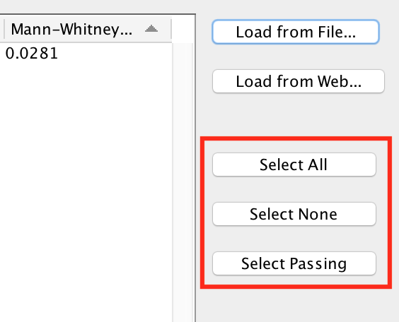

* Select All

  * Select all the gene sets in the list.
  * Note: Gene sets that do not pass the cutoff will not have any edges when added to the network.

* Select None

  * None of the gene sets in the list will be selected. This is useful if you want to de-select the
    gene sets that were selected by default and then manually select individual gene sets by clicking
    on the checkboxes in the *Import* column.

* Select Passing

  * Selects just the gene sets that pass the current cutoff. This is the default.

.. note:: Any changes made in the *Edge Weight Parameters* panel may cause the current selection to change.

2) Edge Weight Parameters
-------------------------

Any changes made to the *Edge Weight Parameters* will cause the *Signature Gene Sets List* to be 
automatically updated.

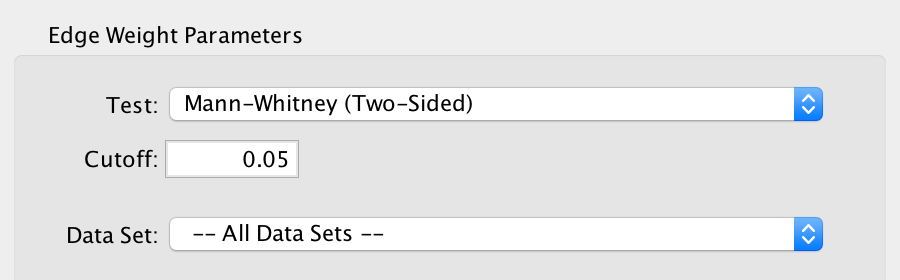

* Test
  
  * Select the type of statistical test to use for edge weight.
  * Each type of test is explained in more detail below.

* Cutoff

  * Edges with a similarity score lower than the one entered will not be included in the network.
  
* Data Set

  * Select the data set to run post analysis against, or *All Data Sets*.
  * This field is disabled if the EnrichmentMap network contains only one data set.

Notes:

* The results of the calculations will be available in the edge table after post analysis runs.
* The edge “interaction type” will be "sig".
* The hypergeometric test is always calculated, even if it is not used for the cutoff. 
  The results are made available in the edge table.

Mann-Whitney
~~~~~~~~~~~~

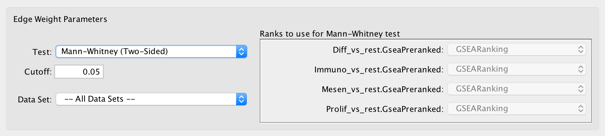

* Calculates the p-value using the Mann-Whitney U test where the first sample is the ranks in the 
  overlap and the second sample is all of the ranks in the expression set.
* The Mann-Whitney test requires ranks. It will not be available if the enrichment map was 
  created without ranks. 
* If a data set has more than one ranks file then it may be selected in the adjacent panel.

.. note:: Additional ranks files can be loaded from the Heat Map :ref:`heat_map_menu`.

Hypergeometric
~~~~~~~~~~~~~~

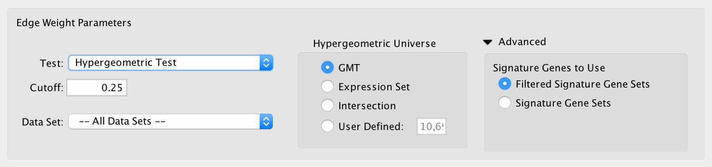

* Hypergeometric Test is the probability (p-value) to find an overlap of k or more genes 
  between a signature gene set and an enrichment gene set by chance.

|formula|

with:

| **k** (successes in the sample) : size of the Overlap,
| **n** (size of the sample) : size of the Signature gene set
| **m** (total number of successes) : size of the Enrichment gene set
| **N** (total number of elements) : size of the union of all Enrichment gene sets
|

* Hypergeometric Universe: Allows to choose the value for **N**.

  * GMT: All the genes in the original GMT file, before filtering.
  * Expression Set: Number of genes in the expression set. 
  * Intersection: Number of genes in the intersection of the GMT file and expression set.
  * User Defined: Manually enter a value. 

* Advanced - Signature Genes To Use: Allows to choose the value for **n**

  * This panel is hidden by default, click the arrow next to *Advanced* to expand the panel.
  * Filtered Signature Gene Sets: Size of the signature gene set intersected with the 
    genes in the data set.
  * Signature Gene Sets: Size of the signature gene set.

Overlap
~~~~~~~

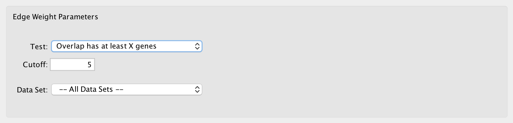

* Overlap has at least X genes

  * The number of genes in the overlap between the enrichment map gene set and the 
    signature gene set must be at least X for the edge to be created. 

* Overlap is X percent of EM gs

  * The size of the overlap must be at least X percent of the size of the Enrichment Map gene set. 

* Overlap is X percent of Sig gs
      
  * The size of the overlap must be at least X percent of the size of the Signature gene set. 

3) Data Set Name
----------------

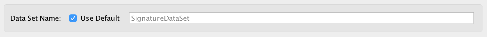

A name for the signature data set will be automatically generated based on the name of
the GMT file that was loaded.

To enter a name for the data set first de-select the **Use Default** checkbox then enter the name.

.. _edge_width_dialog:

Edge Width Dialog
-----------------

When you create an Enrichment Map network a visual style is created. The default edge width 
property is a continuous mapping to the *similarity_coefficient* column. After running 
post-analysis the rules for calculating edge width become more complicated. Edge width for 
edges between enrichment sets are still based on the *similarity_coefficient* column, but 
edges between signature sets and enrichment sets are based on the statistical test used 
for cutoff. Currently Cytoscape does not provide a visual mapping that is capable of “if-else” 
logic. In order to work around this limitation, the width of the edges is calculated by 
EnrichmentMap and put into a new column called *EM1_edge_width_formula*. Then the edge width 
property uses a continuous mapping to that column.

To open the dialog click the **Set Signature Edge Width..** button in the style section of the main panel.

.. image:: images/pa/edge_width_button.png
   :width: 40%

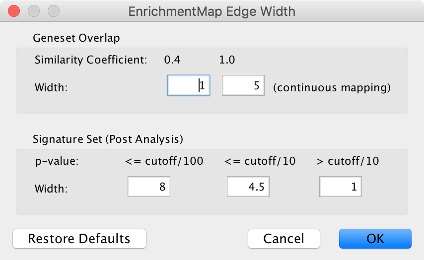
   
* Edge Width Dialog

  * Gene set Overlap: Set the end points of the continuous mapping for edge width for edges 
    between enrichment sets.
  * Signature Set: Set the edge width value for signature set edges that are less than 
    cutoff/100, <= cutoff/10 and > cutoff/10.
  * Click OK to recalculate the values in the “EM1_edge_width_formula” column. 
