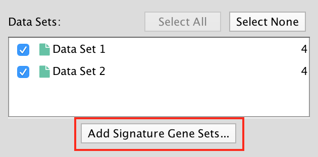
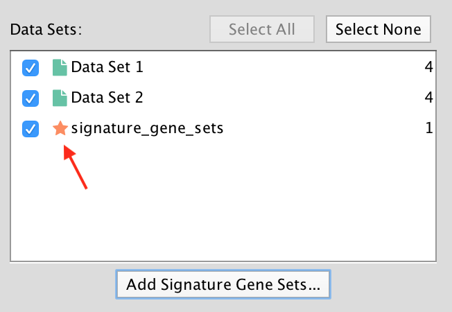
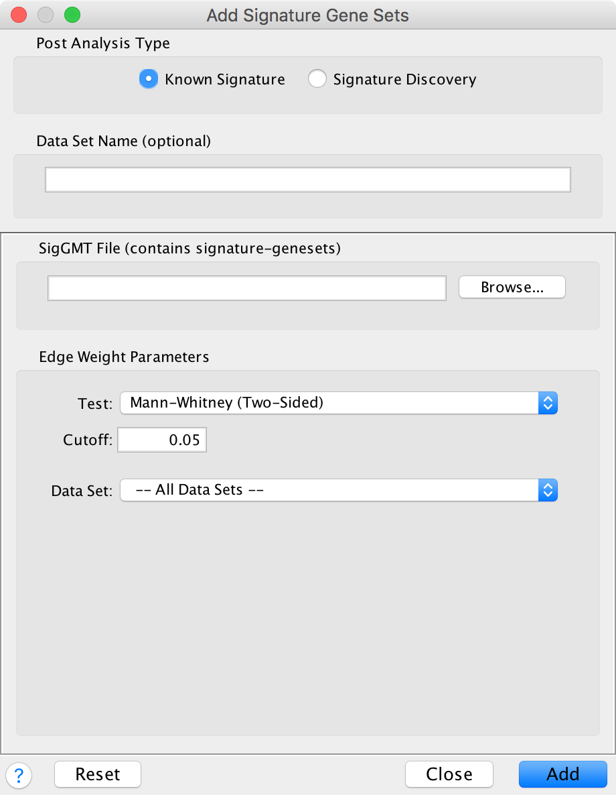
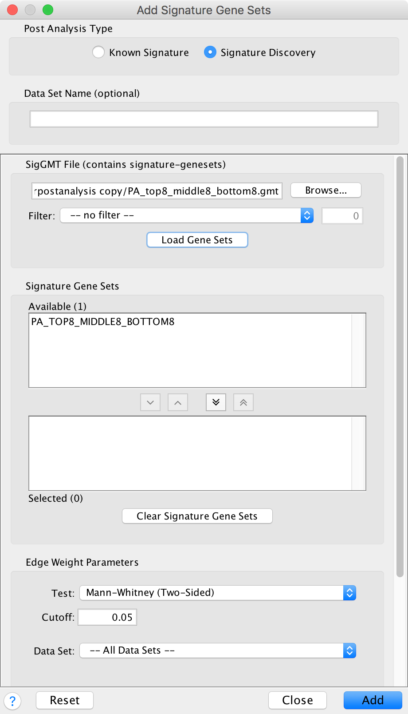

.. _post_analysis:

Post Analysis 
=============

To open the Post Analysis dialog click the **Add Signature Gene Sets...** button on the main panel.

There are currently two types of Post Analysis Available: **Known Signature** and **Signature Discovery**. 
The contents of the panel will change depending on the type of analysis chosen. Known signature 
mode calculates post analysis edges for a small subset of known gene-sets. Signature discovery 
mode allows for filtering of large set of potential signatures to help uncover most likely sets.

.. image:: images/pa/signature_network.png
   :width: 40%
   :align: right

The result of running Post Analysis is a new node for each signature gene set (yellow triangle) 
and edges from the signature gene set to each existing gene set when the similarity passes the 
cutoff test. 

.. |star| image:: images/pa/star.png
   :width: 18px

A new data set is added to the data set list on the Main panel. 
Signature data sets have a |star| next to their name.

Known Signature
---------------

1. Post Analysis Type

   * Known Signature: Calculates the overlap between gene-sets of the current Enrichment Map 
     and all the gene sets contained in the provided signature file. 

2. Gene Sets

   * SigGMT: The gmt file with the signature-genesets. These will be compared against the 
     gene-sets from the current Enrichment Map. 

3. Edge Weight Parameters
 
   * Choose a method for generating an edge between a signature-geneset 
     and an enrichment geneset. Described in detail below.

4. Actions: 
 
   * Reset - clears input panel
   * Close - closes input panel
   * Add - takes all parameters in panel and performs the Post-Analysis

Signature Discovery
-------------------

1. Post Analysis Type

   * Signature Discovery: Calculates the overlap between gene-sets of the current Enrichment 
     Map and the selected genesets. 

2. Gene-Sets

   * The gmt file with the signature-genesets.
   * Filter: Genesets from the gmt file that do not pass the filter test will not be loaded.
   * Load Gene-Sets: Press after the gmt file and filter have been chosen to load the 
     signature-genesets. 

3. Available Signature Genesets: Once the genesets have been loaded this box will contain a list 
   of all the genesets in the SigGMT file (that passed the filter).

   * To highlight more than one geneset at at time hold the Shift, Command or Ctrl keys while 
     clicking with the mouse. 

4. Selected Signature Genesets: The analysis will be performed with all genesets in this list. 
   Use the down- and up-buttons to move highlighted genesets from one list to the other.

5. Edge Weight Parameters: Choose a method for generating an edge between a signature-geneset 
   and an enrichment geneset. Described in detail below.

6. Actions: 
 
   * Reset - clears input panel
   * Close - closes input panel
   * Add - takes all parameters in panel and performs the Post-Analysis

Edge Weight Parameters
----------------------

.. image:: images/pa/edge_weight_panel.png
   :align: right
   :width: 45%

.. |formula| image:: images/pa/Hypergeometric_test_Formula.png

1. Test: Select the type of statistical test to use for edge width.
2. Cutoff: Edges with a similarity value lower than the cutoff will not be created.
3. Data Set: If the enrichment map contains multiple data sets choose the one to use here.
4. Notes:

   * The results of the calculations will be available in the edge table after post analysis runs.
   * The edge “interaction type” will be sig.
   * The hypergeometric test is always calculated, even if it is not used for the cutoff. The 
     results are made available in the edge table. 

5. Available Tests

   * Hypergeometric Test is the probability (p-value) to find an overlap of k or more genes 
     between a signature geneset and an enrichment geneset by chance.
   
     |formula|

     with:

     | k (successes in the sample) : size of the Overlap,
     | n (size of the sample) : size of the Signature geneset
     | m (total number of successes) : size of the Enrichment Geneset
     | N (total number of elements) : size of the union of all Enrichment Genesets
     |

     * Advanced Hypergeometric Universe: Allows to choose the value for N.

       * GMT: all the genes in the original gmt file, Expression Set: number of genes in the 
         expression set, 
       * Intersection: number of genes in the intersection of the gmt file and expression set, 
       * User Defined: manually enter a value). 

  * Overlap has at least X genes

    * The number of genes in the overlap between the enrichment map gene set and the 
      signature gene set must be at least X for the edge to be created. 

  * Overlap is X percent of EM gs

    * The size of the overlap must be at least X percent of the size of the Enrichment Map gene set. 

  * Overlap is X percent of Sig gs
        
    * The size of the overlap must be at least X percent of the size of the Signature gene set. 

  * Mann-Whitney (Two-sided, one-sided greater, one-sided less)

    * Note: The Mann-Whitney test requires ranks. It will not be available if the enrichment map 
      was created without ranks.
    * Calculates the p-value using the Mann-Whitney U test where the first sample is the ranks 
      in the overlap and the second sample is all of the ranks in the expression set. 

.. _edge_width_dialog:

Edge Width Dialog
-----------------

When you create an Enrichment Map network a visual style is created. The default edge width 
property is a continuous mapping to the *similarity_coefficient* column. After running 
post-analysis the rules for calculating edge width become more complicated. Edge width for 
edges between enrichment sets are still based on the *similarity_coefficient* column, but 
edges between signature sets and enrichment sets are based on the statistical test used 
for cutoff. Currently Cytoscape does not provide a visual mapping that is capable of “if-else” 
logic. In order to work around this limitation, the width of the edges is calculated by 
EnrichmentMap and put into a new column called *EM1_edge_width_formula*. Then the edge width 
property uses a continuous mapping to that column.

To open the dialog click the **Set Signature Edge Width..** button in the style section of the main panel.

.. image:: images/pa/edge_width_button.png
   :width: 40%

.. image:: images/pa/edge_width_dialog.png
   :align: right
   :width: 40%
   
* Edge Width Dialog

  * Geneset Overlap: Set the end points of the continuous mapping for edge width for edges 
    between enrichment sets.
  * Signature Set: Set the edge width value for signature set edges that are less than 
    cutoff/100, <= cutoff/10 and > cutoff/10.
  * Click OK to recalculate the values in the “EM1_edge_width_formula” column. 
