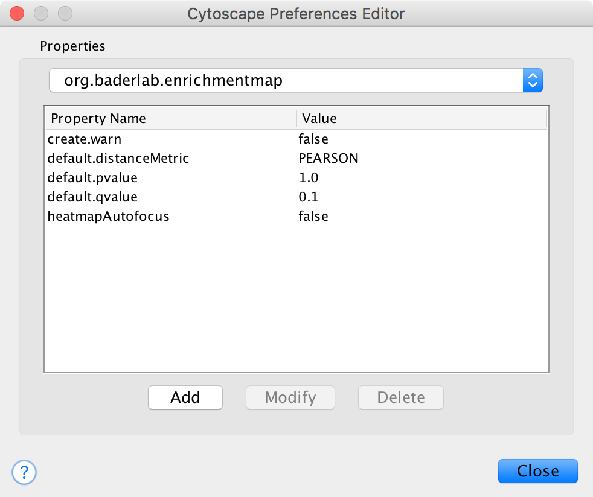
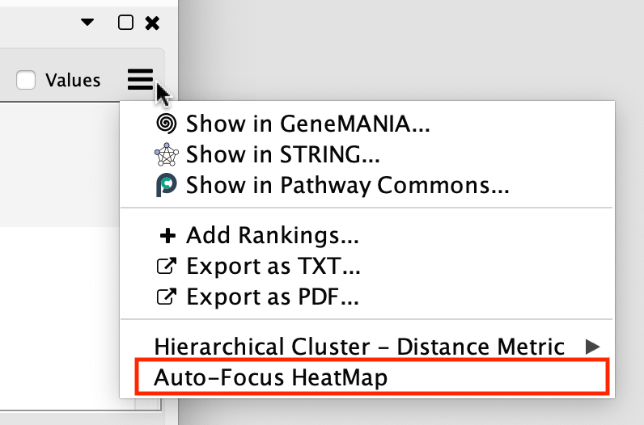
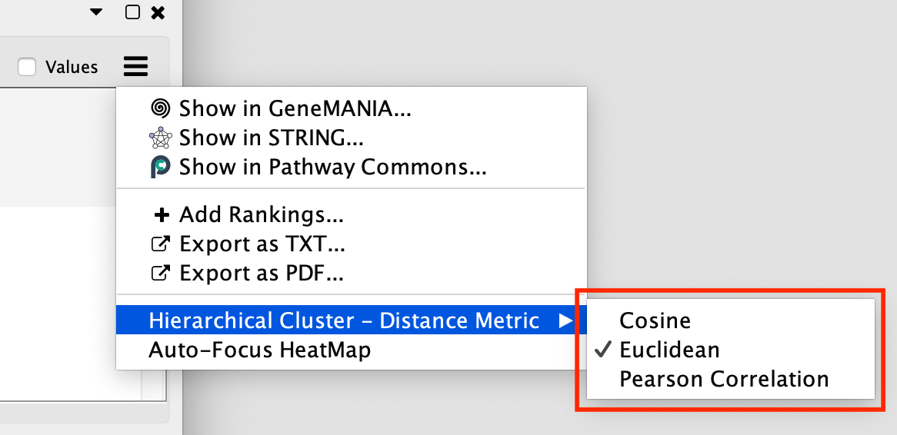
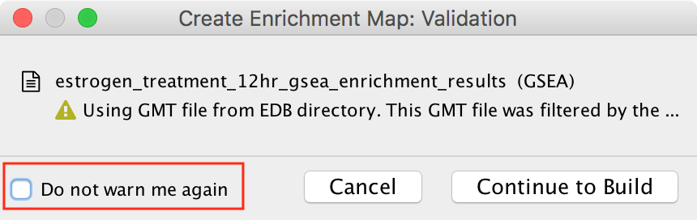
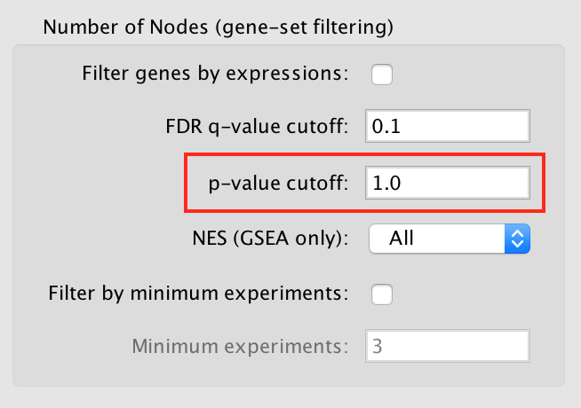
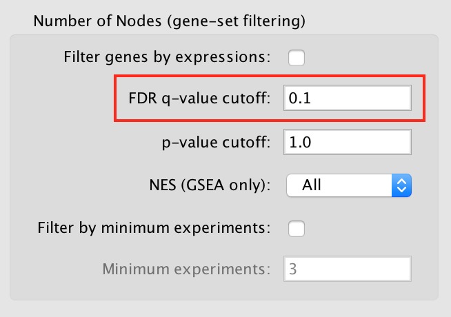

Properties
----------

EnrichmentMap has some semi-hidden properties than can be used to customize
the behavior of the App.

To manually edit these properties go to the Cytoscape main menu and select 
**Edit > Preferences > Properties...**. Then select **org.baderlab.enrichmentmap**
in the *Cytoscape Preferences Editor*.

Supported properties: 

heatmapAutofocus
  * If true then selecting a node/edge in the network will automatically bring the
    Heat Map panel to the front.
  * This property can also be changed from the Heat Map using the :ref:`heat_map_menu`.
  * Default Value: *false*
  * Allowed Values: *true*, *false*
  * |img1|

default.distanceMetric
  * Specifies the how the Hierarchical Clustering algorithm calculates distance.
  * This property can also be changed from the Heat Map using the :ref:`heat_map_menu`.
  * Default Value: *PEARSON*
  * Allowed Values: *PEARSON*, *EUCLIDEAN*, *COSINE*
  * |img2|

create.warn
  * When creating a network with the *Create EnrichmentMap Dialog* sometimes a validation warning
    dialog will be shown if there are any issues that need to be brought to the user's attention.
    If this property is set to *false* then the warning dialog will never be shown even if there are issues.
    Note: The dialog will still be shown if there are errors that prevent the network from being created.
  * Default Value: *true*
  * Allowed Values: *true*, *false*
  * |img3|

default.pvalue
  * Default p-value in the *Create EnrichmentMap Dialog*
  * Default Value: *1.0*
  * Allowed Values: *> 0.0, < 1.0*
  * |img4|

default.qvalue
  * Default q-value in the *Create EnrichmentMap Dialog*
  * Default Value: *0.1*
  * Allowed Values: *> 0.0, < 1.0*
  * |img5|