Quick Tour
==========

.. _The EnrichmentMap Protocol: https://baderlab.github.io/Cytoscape_workflows/EnrichmentMapPipeline/index.html

.. note:: Please see `The EnrichmentMap Protocol`_ for details on automating EnrichmentMap.

Creating the Network
--------------------

To create an Enrichment Map network go to the Cytoscape main menu and select **Apps > EnrichmentMap**.

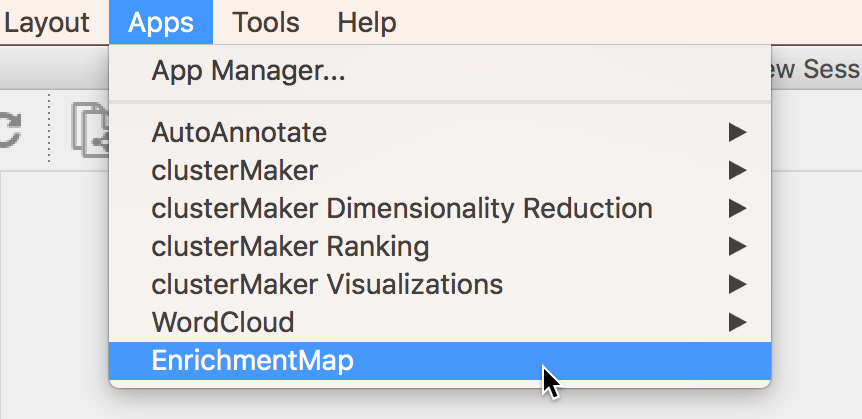

This will show the EnrichmentMap panels and open the **Create EnrichmentMap Dialog**.

.. note:: If the Create EnrichmentMap Dialog does not appear then click the (+) icon at the 
          top of the EnrichmentMap Main Panel.

The quickest way to import data is to scan a folder for enrichment analysis data files (for example
a GSEA results folder).

Click the |icon_scan| icon and select a folder. EnrichmentMap will scan the folder
for files containing enrichment data, expression data, ranks, classes and gene set definitions.
These files will be arranged into a **List of Data Sets**, each of which contains the data for 
one experiment. Click the **Build** button to create the network.

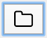

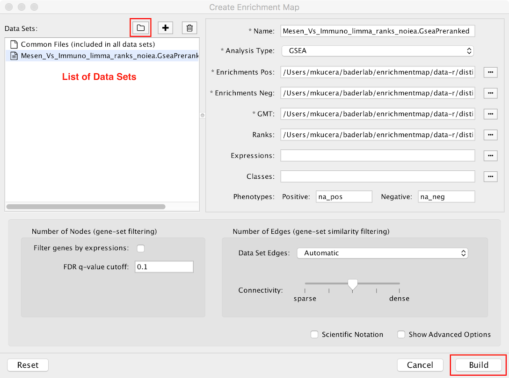

For more details see :ref:`creating_network`.

Panels
------

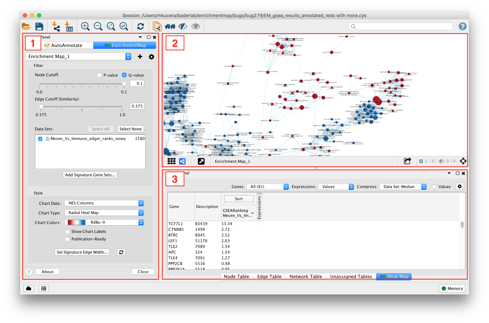

1. **Main EnrichmentMap Panel**

   * Used to customize the look of the network in several ways.

2. **EnrichmentMap Network**

   * The Cytoscape network view shows the EnrichmentMap network.

3. **HeatMap (Expression) Panel**

   * Shows gene expression data for selected nodes and edges.

Interpreting the Network
------------------------

* Nodes represent gene sets.
* Node size represents the number of genes in the gene set.
* Edges represent overlap between gene sets.
* Edge width represents the number of genes that overlap.
* The default layout algorithm causes gene sets with high overlap to cluster together.
* Each node contains a chart that shows the enrichment scores, such as NES (for GSEA), 
  p-value or fdr q-value. The enriched phenotype is conveyed by a color gradient. The
  chart data can be changed using the **Style** section of the EnrichmentMap panel.

.. image:: images/quicktour/network.png
   :width: 80%

EnrichmentMap creates several columns in the node and edge tables. They can
be seen in the **Node Table** and **Edge Table** panels. Columns created by
EnrichmentMap start with "EM".

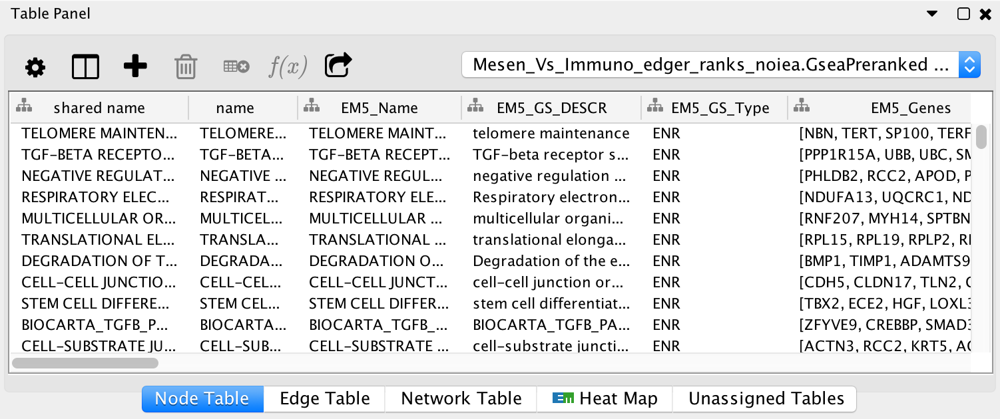

For more details on attributes see |Attributes|.

Main EnrichmentMap Panel
------------------------

The Main EnrichmentMap Panel can be used to customize the network in several ways.

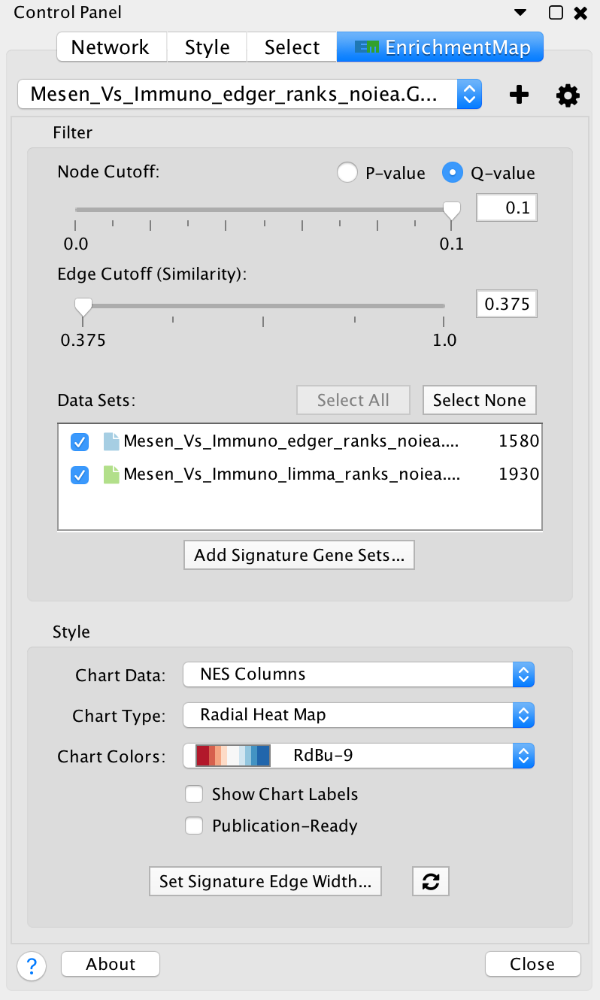

* Filter section

  * **Node cutoff slider**: Nodes with a p-value or q-value that do not pass the cutoff
    are hidden from view.
  * **Edge cutoff slider**: Edges with a similarity score that does not pass the cutoff
    are hidden from view.
  * **Data set list**: Lists Data Sets that were used to create the network. Unchecking
    the checkbox next to the name of a data set causes gene set nodes that are not
    contained in the data set to be hidden from view.
  * **Add signature gene sets button**: Opens the Post Analysis dialog which is used 
    to add more gene sets to the network.

* Style section

  * **Chart data**: Allows to pick which data columns are used by the node charts 
    (e.g. NES, p-value or q-value).
  * **Chart type**: Various chart visualizations are available.
  * **Chart colors**: Various color schemes are available for the charts.

For more details on the EnrichmentMap panel see |EnrichmentMap Panel|.

Legend Dialog
-------------

The legend dialog can be opened by clicking on the gear icon at the top of the main
panel and selecting **Show Legend**.

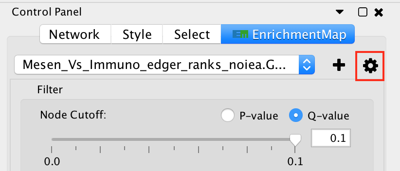

The Legend Dialog shows a visual representation of how the network
elements can be interpreted, including what data is visible on the
node charts. The legend can be exported as a PDF file.

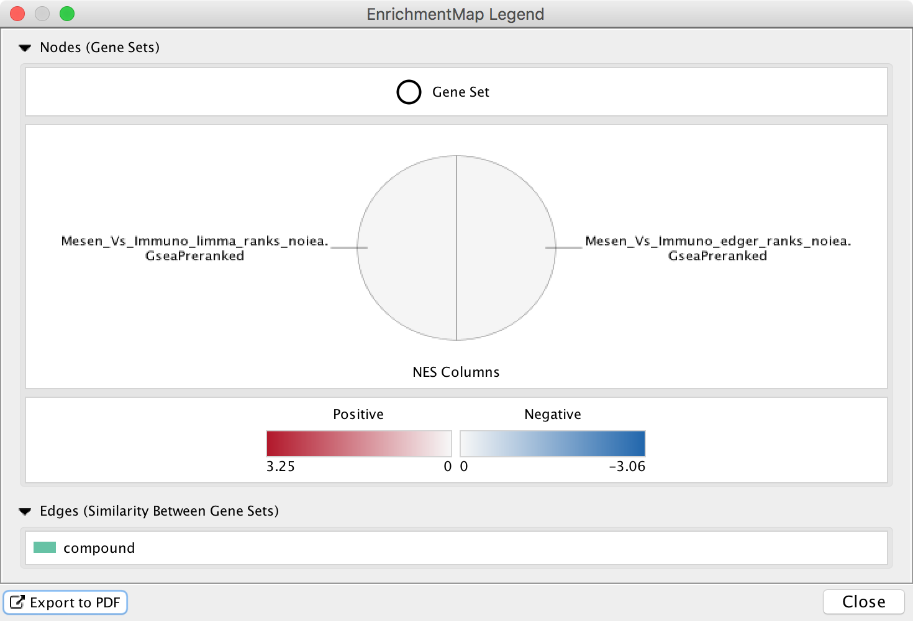

HeatMap (Expressions) Panel
---------------------------

The HeatMap panel shows gene expression data for selected nodes and edges.

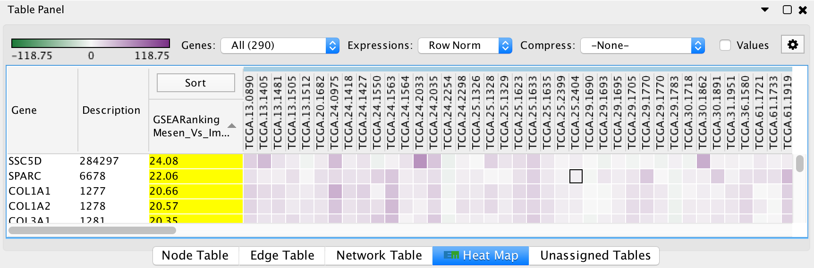

* **Genes**: You may select multiple gene sets (by selecting several nodes or edges).
  When more than one gene set is selected you may choose to view 
  all of the genes (union) or just the genes that are common (intersection).
* **Expressions**: Allows to show the raw expression data or to normalize the data.
* **Compression**: If there is a large number of expression columns in the HeatMap they
  can be compressed down to the median, min or max value.
* **Show values**: When selected shows the actual expression values, otherwise just shows
  the color gradient.
* The contents of the HeatMap can be exported to a TXT or PDF file.

Post Analysis (Add Signature Gene Sets)
---------------------------------------

The **Add Signature Gene Sets** panel you to add more gene sets to an existing network. This is
also called **Post Analysis**.

To access the dialog click the **Add Signature Gene Sets...** button on the Main EnrichmentMap panel.

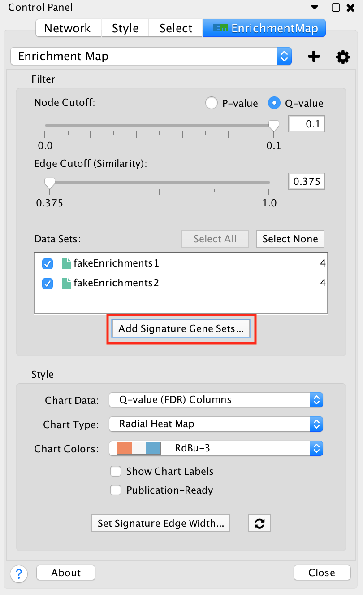

There are currently two types of Post Analysis Available: Known Signature and Signature Discovery. 
The contents of the panel will change depending on the type of analysis chosen. 
Known signature mode calculates post analysis edges for a small subset of known gene-sets. 
Signature discovery mode allows for filtering of large set of potential signatures to help 
uncover most likely sets.

|dialog_1| |dialog_2|

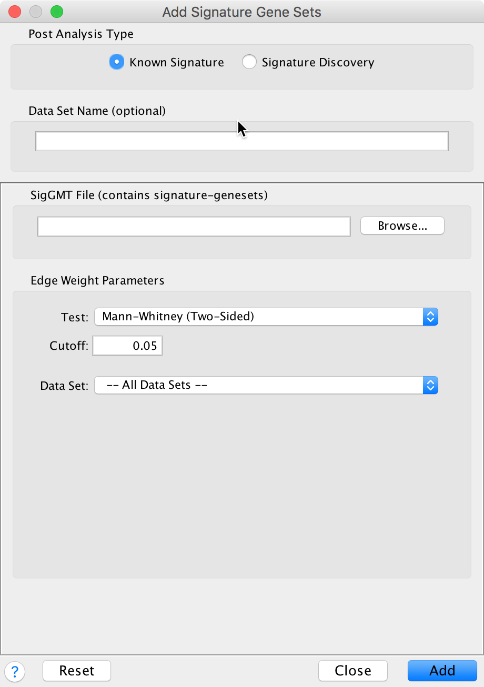

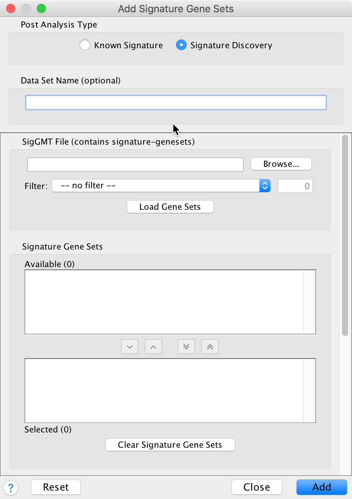

The result of running Post Analysis is a new node for each signature gene set (yellow triangle) 
and edges from the signature gene set to each existing gene set when the similarity passes the 
cutoff test. A new data set for the signature gene sets is added to the data set list on the
Main EnrichmentMap panel.

