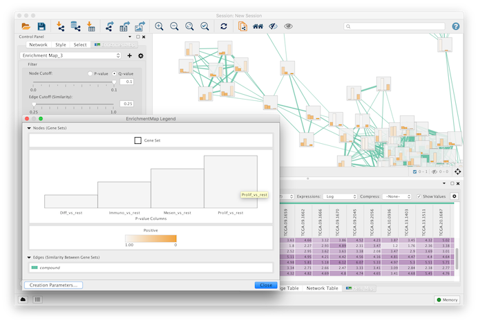

EnrichmentMap Cytoscape App 3.1
===============================

.. _The EnrichmentMap Protocol: https://baderlab.github.io/Cytoscape_workflows/EnrichmentMapPipeline/index.html

|screenshot1| |screenshot2|

Enrichment analysis (also known as functional enrichment) is an helpful technique for high-throughput 
data interpretation. Given a list of genes resulting from an experiment, enrichment analysis enables 
to identify functional categories that are over-represented. Such functional categories are typically 
derived from functional annotations (such as the Gene Ontology), or from pathway databases (such as 
KEGG), or other resources (such as the collection of disease signatures in MSig DB, or protein 
complexes in MIPS).

However, enrichment results are often characterized by lots of redundancy and inter-dependencies 
between gene-sets representing functional categories. For instance, *Response to radiation*, 
*DNA Integrity Checkpoint* and *p53 Pathway* have several genes in common. Since the typical 
enrichment analysis can output up to 300 hundred different gene-sets, some form of organization is 
required to navigate results. 

To address this, we organize gene-sets into a network, called enrichment map. Two gene-sets are 
connected in the *enrichment map network* if they have a high overlap, i.e. if they share many genes. 
Applying automatic layout techniques, groups of inter-related gene-sets tend to cluster together, 
providing for a much easier and intuitive visualization. 

Please also see `The EnrichmentMap Protocol`_ for details on automating EnrichmentMap.

.. |screenshot2| image:: images/index/screenshot_2.png
   :width: 45%

Feature Requests and Reporting Bugs
-----------------------------------

The EnrichmentMap GitHub issue tracker can be used to report a bug or request a feature.

To Report a bug:

* Go to https://github.com/BaderLab/EnrichmentMapApp/issues
* Click on *New Issue*
* Write a short description of the issue. It is very helpful to provide a series of steps
  that can be taken to reproduce the issue.
* If possible attach a session file (.cys) or example input files.
* Enter App version, Cytoscape version and operating system.
* Click on *Submit new issue*

Cite EnrichmentMap
------------------

* | **Enrichment Map: A Network-Based Method for Gene-Set Enrichment Visualization and Interpretation**
  | Merico D, Isserlin R, Stueker O, Emili A, Bader GD
  | `PLoS One. 2010 Nov 15;5(11):e13984 <http://journals.plos.org/plosone/article?id=10.1371/journal.pone.0013984>`_.
  | `PubMed Abstract <https://www.ncbi.nlm.nih.gov/pubmed/21085593>`_ - :download:`PDF <downloads/2010_MericoIsserlinStuekerBader-EnrichmentMap_PLoSOne.pdf>`

Examples of Use
---------------

* | **Functional impact of global rare copy number variation in autism spectrum disorders.**
  | Pinto D, Pagnamenta AT, Klei L, Anney R, Merico D, Regan R, Conroy J, Magalhaes TR, Correia C, Abrahams BS, Almeida J, Bacchelli E, Bader GD, et al.
  | `Nature. 2010 Jun 9 (Epub ahead of print) <https://www.nature.com/articles/nature09146>`_
  | `PubMed Abstract <https://www.ncbi.nlm.nih.gov/pubmed/20531469>`_ - :download:`PDF <downloads/2010_AutismNature.pdf>`
  | `Nature Blogs <http://blogs.nature.com/news/2010/06/rare_genetic_variants_linked_t.html>`_ 

* | **Pathway analysis of dilated cardiomyopathy using global proteomic profiling and enrichment maps**
  | Isserlin R, Merico D, Alikhani-Koupaei R, Gramolini A, Bader GD, Emili A.
  | `Proteomics 2010, March 10(6):1316-27 <http://onlinelibrary.wiley.com/doi/10.1002/pmic.200900412/abstract>`_
  | `Pubmed Abstract <https://www.ncbi.nlm.nih.gov/pubmed/20127684>`_ - :download:`PDF <downloads/2010_EM_proteomics.pdf>`

Papers Citing Enrichment Map
----------------------------

* | `Citations in Pubmed Central <https://www.ncbi.nlm.nih.gov/pubmed?db=pubmed&cmd=link&linkname=pubmed_pubmed_citedin&uid=21085593>`_

* | **Pathway analysis of expression data: deciphering functional building blocks of complex diseases.**
  | Emmert-Streib F, Glazko GV.
  | PLoS Comput Biol. 2011 May;7(5):e1002053.
  | `PubMed <https://www.ncbi.nlm.nih.gov/pubmed/21637797>`_

* | **Inflammasome is a central player in the induction of obesity and insulin resistance.**
  | Stienstra R, van Diepen JA, Tack CJ, Zaki MH, van de Veerdonk FL, Perera D, Neale GA, Hooiveld GJ, Hijmans A, Vroegrijk I, van den Berg S, Romijn J, Rensen PC, Joosten LA, Netea MG, Kanneganti TD.
  | Proc Natl Acad Sci U S A. 2011 Aug 29.
  | `PubMed <https://www.ncbi.nlm.nih.gov/pubmed/21637797>`_

* | **Delineation of Two Clinically and Molecularly Distinct Subgroups of Posterior Fossa Ependymoma**
  | Witt H, Mack SC, Ryzhova M, Bender S, Sill M, Isserlin R, Benner A, Hielscher T, Milde T, Remke M, Jones DTW, Northcott PA, Garzia L, Bertrand KC, Wittmann A, Yao Y, Roberts SS, Massimi L, Van Meter T, Weiss WA, Gupta N, Grajkowska W, Lach B, Cho YJ, von Deimling A, Kulozik AE, Witt O, Bader GD, Hawkins CE, Tabori U, Guha A, Rutka JT, Lichter P, Korshunov A, Taylor MD, Pfister SM
  | `Cancer Cell, Volume 20, Issue 2, 143-157, 16 August 2011 <https://www.sciencedirect.com/science/article/pii/S1535610811002625>`_
  | `PubMed Abstract <https://www.ncbi.nlm.nih.gov/pubmed/21840481>`_ - :download:`PDF <downloads/ependymoma.pdf>`

.. toctree::
   :maxdepth: 2
   :caption: User Guide:

   Installation
   QuickTour
   CreatingNetwork
   Network
   Columns
   MainPanel
   HeatMapPanel
   LegendDialog
   PostAnalysis
   FileFormats
   Parameters
   GeneSets
   Automating
   Properties
   collapse_ExpressionMatrix.py

   
.. toctree::
   :maxdepth: 2
   :caption: Links:

   EnrichmentMap Protocol <https://baderlab.github.io/Cytoscape_workflows/EnrichmentMapPipeline/index.html>
   Cytoscape.org <http://cytoscape.org>
   Cytoscape App Store <http://apps.cytoscape.org/apps/enrichmentmap>
   Baderlab.org <http://baderlab.org>
   GitHub <https://github.com/BaderLab/EnrichmentMapApp>
