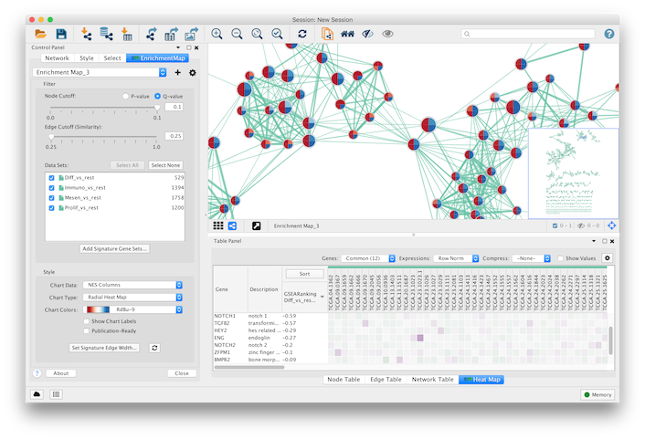

EnrichmentMap Cytoscape App 3.0
===============================

.. _The EnrichmentMap Protocol: https://baderlab.github.io/Cytoscape_workflows/EnrichmentMapPipeline/index.html

|screenshot1| |screenshot2|

Enrichment analysis (also known as functional enrichment) is an helpful technique for high-throughput 
data interpretation. Given a list of genes resulting from an experiment, enrichment analysis enables 
to identify functional categories that are over-represented. Such functional categories are typically 
derived from functional annotations (such as the Gene Ontology), or from pathway databases (such as 
KEGG), or other resources (such as the collection of disease signatures in MSig DB, or protein 
complexes in MIPS).

However, enrichment results are often characterized by lots of redundancy and inter-dependencies 
between gene-sets representing functional categories. For instance, *Response to radiation*, 
*DNA Integrity Checkpoint* and *p53 Pathway* have several genes in common. Since the typical 
enrichment analysis can output up to 300 hundred different gene-sets, some form of organization is 
required to navigate results. 

To address this, we organize gene-sets into a network, called enrichment map. Two gene-sets are 
connected in the *enrichment map network* if they have a high overlap, i.e. if they share many genes. 
Applying automatic layout techniques, groups of inter-related gene-sets tend to cluster together, 
providing for a much easier and intuitive visualization. 

Please also see `The EnrichmentMap Protocol`_ for details on automating EnrichmentMap.

.. toctree::
   :maxdepth: 2
   :caption: User Guide:

   Installation
   QuickTour
   CreatingNetwork
   Network
   Columns
   MainPanel
   HeatMapPanel
   FileFormats
   Parameters
   PostAnalysis

   
.. toctree::
   :maxdepth: 2
   :caption: Links:

   EnrichmentMap Protocol <https://baderlab.github.io/Cytoscape_workflows/EnrichmentMapPipeline/index.html>
   Cytoscape.org <http://cytoscape.org>
   Cytoscape App Store <http://apps.cytoscape.org/apps/enrichmentmap>
   Baderlab.org <http://baderlab.org>
   GitHub <https://github.com/BaderLab/EnrichmentMapApp>
